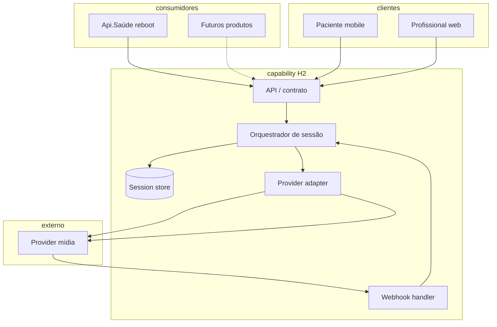
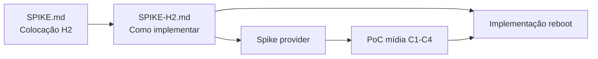

# Spike H2 — Como implementar a capability de videoconsulta

> **Objetivo:** definir **como** construir e operar a capability desacoplada de videoconsulta (H2) — contrato, colocação, integração com consumidores e clientes. **Não** é spike de provider (Twilio vs GetStream vs outros); isso vem após ou em paralelo controlado.
>
> **Pré-requisitos:** [SPIKE.md](./SPIKE.md) (decisões arquiteturais) · [ADR-001](./docs/adr/ADR-001-colocacao-videoconsulta.md)

---

## 0. Herança da spike anterior (já decidido)

Não rediscutir — usar como restrições de design.

| Decisão | Referência |
|---------|------------|
| H2 — capability desacoplada; H1/legado rejeitados | [SPIKE §1](./SPIKE.md#1-perguntas-que-a-spike-deve-responder) |
| Capability = fonte da verdade do estado da sessão | [SPIKE §3.2.1](./SPIKE.md#321-fonte-da-verdade-do-estado-da-sessão) |
| Estados: `criada` → `aguardando` → `mídia_pendente` → `ativa` → `encerrada` / `vetada` | [SPIKE §7](./SPIKE.md#7-diagrama-de-estados) |
| C3 híbrido; grace period adiado | [SPIKE §3.2.2](./SPIKE.md#322-política-de-reconexão-c3) |
| C4: médico veta; paciente tardio não entra | [SPIKE §0.5](./SPIKE.md#c2-c4-e-migração-decisões-complementares) |
| C2: timeout/encerramento = regra do **consumidor** | [SPIKE §0.5](./SPIKE.md#c2--no-show--lobby) |
| Cutover com reboot Api.Saúde; não integrar no legado | [SPIKE §0.5](./SPIKE.md#migração-twilio--go-rooms) |
| Gravação fora de escopo | [SPIKE §0.4](./SPIKE.md#fora-de-escopo-mvp--spike) |
| PoC **não** valida desencontros do legado | [SPIKE §9](./SPIKE.md#9-escopo-do-poc-futuro-fase-pós-spike-arquitetural) |
| Chat no **Dr Clin** (Api.Saúde **não** usa) — **não** estender como base de vídeo; refatoração condicional se vídeo for adicionado ao Dr Clin | [SPIKE §0.1](./SPIKE.md#getstream-chat-vs-vídeo-h3) |

**Primeiro consumidor:** Api.Saúde rebootada. **Clientes de mídia:** paciente mobile-first (React Native); profissional/backoffice desktop+responsivo (Angular).

**Stack do time (familiaridade):** backend **Node.js / NestJS**; web **Angular**; mobile **React Native** — ver [SPIKE §0.6](./SPIKE.md#familiaridade-do-time-stack). Capability H2 tende a NestJS; consumidor Api.Saúde integra via contrato independente da stack do reboot.

---

## 1. Perguntas que esta spike deve responder

| # | Pergunta | Resposta | Evidência | Status |
|---|----------|----------|-----------|--------|
| 1 | **Colocação:** serviço dedicado, módulo deployável ou biblioteca compartilhada? | | | 🔴 Aberto |
| 2 | **Contrato:** quais APIs/comandos a capability expõe aos consumidores? | | | 🔴 Aberto |
| 3 | **Estado:** onde persiste sessão e transições (DB, cache)? | | | 🔴 Aberto |
| 4 | **Clientes:** como recebem atualizações de estado (poll, SSE, WebSocket)? | | | 🔴 Aberto |
| 5 | **Provider:** como abstrair Twilio/outro (adapter, webhooks, tokens)? | | | 🔴 Aberto |
| 6 | **Auth:** como consumidor e participantes autenticam na capability? | | | 🔴 Aberto |
| 7 | **Front-end:** SDK compartilhado, módulo por app ou integração direta? | | | 🔴 Aberto |
| 8 | **Operação:** deploy, observabilidade, ownership — quem roda o quê? | | | 🔴 Aberto |
| 9 | **MVP H2:** qual fatia mínima entregável com o reboot? | | | 🔴 Aberto |

---

## 2. Hipóteses de implementação

| ID | Hipótese | Descrição | Quando favorece |
|----|----------|-----------|-----------------|
| **H2-A** | **Microserviço dedicado** | Serviço `videoconsulta` independente; Api.Saúde consome via HTTP/events | Reuso multi-produto; deploy/evolução independente |
| **H2-B** | **Módulo / bounded context no reboot** | Capability como serviço ou módulo no mesmo ecossistema de deploy, contrato público interno | Time único no reboot; menos overhead operacional inicial |
| **H2-C** | **Platform capability compartilhada** | Infra transversal Clin&Co (como **padrão alvo** de modalidade realtime), múltiplos consumidores desde o dia 1 | Forte push de reuso; time de plataforma existe — **chat do Dr Clin hoje não cumpre** esse padrão (acoplado ao produto; Api.Saúde não usa — [SPIKE §0.1](./SPIKE.md#getstream-chat-vs-vídeo-h3)) |

**Nota:** H2-A, H2-B e H2-C podem convergir — ex.: começar H2-B com **contrato estável** preparado para extrair H2-A depois. **Lição do Dr Clin:** nascer com contrato consumidor × capability evita refatoração futura se outra modalidade (ex.: vídeo) for adicionada depois ao mesmo produto.

---

## 3. Dimensões de avaliação

### 3.1 Colocação e deploy

| Critério | Peso (1–3) | H2-A | H2-B | H2-C | Notas |
|----------|------------|------|------|------|-------|
| Reuso entre produtos Clin&Co | 3 | | | | Objetivo do PRD |
| Time-to-MVP com reboot | 3 | | | | ~20 consultas/dia |
| Deploy independente | 2 | | | | |
| Overhead operacional (SRE) | 2 | | | | |
| Clareza de ownership | 2 | | | | |
| Aderência à stack do time (NestJS, Angular, RN) | 2 | | | | [SPIKE §0.6](./SPIKE.md#familiaridade-do-time-stack) |

### 3.2 Stack e implementação

| Camada | Stack preferencial | Notas |
|--------|-------------------|-------|
| Capability (API, orquestração, adapter) | **NestJS** / Node.js | Familiaridade do time; webhooks e REST/gRPC |
| Cliente web (profissional, backoffice) | **Angular** | Desktop + responsivo |
| Cliente mobile (paciente) | **React Native** | Mobile-first; C3 crítico |
| Consumidor (Api.Saúde reboot) | _A definir_ | Integração M2M — **não** precisa ser NestJS |

**Provider:** avaliar SDK server-side Node + client web/mobile nas stacks acima antes de fixar vendor.

### 3.3 Contrato da capability (rascunho para avaliar)

Operações mínimas derivadas do diagrama de estados e C1–C4:

| Operação | Quem chama | Descrição |
|----------|------------|-----------|
| `CreateSession` | Consumidor (Api.Saúde) | Cria sessão (`criada`); associa `consultaId` externo |
| `JoinSession` | Cliente via consumidor ou direto | Emite credencial; transiciona para `aguardando` / `mídia_pendente` |
| `GetSession` | Consumidor / cliente | Lê estado atual (nunca fonte da verdade no cliente) |
| `EndSession` | Consumidor | Encerra (`encerrada`) |
| `VetoSession` | Consumidor (médico/C4) | Transiciona para `vetada` |
| `ConfigureLobbyPolicy` | Consumidor (C2) | Timeout, quem pode encerrar — **política do consumidor** |
| Webhooks provider | Provider → capability | Eventos de mídia; drive `mídia_pendente` → `ativa` |

**Avaliar:** REST vs gRPC; sync vs eventos de domínio; versionamento do contrato.

### 3.4 Persistência e consistência

| Aspecto | Opções a avaliar | Decisão |
|---------|------------------|---------|
| Store de sessão | Postgres, Dynamo, Redis+DB | |
| Idempotência (`JoinSession`) | Chave por participante + sessão | |
| Correlação | `sessionId`, `consultaId`, `providerRoomId` | |
| Event log / audit trail | Necessário para C4 e suporte | |

### 3.5 Integração com clientes (3 superfícies)

| Cliente | Stack | Necessidade | Opções |
|---------|-------|-------------|--------|
| Paciente mobile | **React Native** | Join, estado, reconexão C3 | SDK provider RN + API capability; módulo `@clin/videoconsulta-mobile` |
| Profissional desktop | **Angular** | Join, veto, estado | SDK provider web + API capability; módulo Angular compartilhado |
| Backoffice | **Angular** | Visualização / suporte? | A definir — escopo MVP; mesma stack web |

**Avaliar:** biblioteca `@clin/videoconsulta-client` (wrappers Angular + RN) vs integração direta provider SDK + capability API only. **Provider sem SDK RN ou web maduro** exige camada extra ou penaliza time-to-MVP.

### 3.6 Camada de provider (adapter)

| Responsabilidade | Capability | Adapter |
|------------------|------------|---------|
| Criar/destruir room | Orquestra | Executa no provider |
| Emitir token participante | Orquestra | Executa |
| Receber webhooks mídia | Processa → estado | Normaliza eventos |
| Confirmar mídia bidirecional | **Decide** `ativa` | Informa fatos |

**Avaliar:** interface `IVideoProvider` interna; um adapter por vendor no MVP.

### 3.7 Auth e segurança

| Fluxo | A avaliar |
|-------|-----------|
| Consumidor → capability | M2M (JWT, API key, mesh) |
| Participante → join | Token curto emitido pela capability; scoped por sessão/role |
| Webhooks provider | Assinatura / secret |

### 3.8 Observabilidade e operação

| Item | Necessário no MVP? |
|------|-------------------|
| Logs correlacionados (`consultaId`, `sessionId`) | Sim |
| Métricas: sessões por estado, tempo em `mídia_pendente` | Sim |
| Alertas: sessão presa, webhook falhou | Sim |
| Runbooks C1–C4 | Paralelizar |

---

## 4. Arquitetura de referência (rascunho)

_Preencher e ajustar conforme hipótese H2-A/B/C escolhida._

---

## 5. MVP H2 — fatia mínima (proposta inicial)

Derivado do reboot + C1–C4. Refinar com o time.

| Incluir no MVP | Excluir / fase 2 |
|----------------|------------------|
| Create / Join / Get / End / Veto | Gravação |
| Estados até §7 validado | Grace period C3 (adiado) |
| 1 provider (escolha em spike/provider) | Multi-provider |
| Api.Saúde como único consumidor | Self-service multi-tenant consumidores |
| Anti-desencontro (`mídia_pendente`) | Valores C2 concretos (consumidor define depois) |
| Web + mobile join | Backoffice avançado |

---

## 6. Unknowns desta spike

| # | Unknown | Impacto | Como validar | Status |
|---|---------|---------|--------------|--------|
| 1 | Stack do **consumidor** Api.Saúde reboot (.NET, Node, etc.) | Contrato M2M H2 — **não** exige mesma stack da capability | Engenharia reboot | 🔴 |
| 1b | Stack da **capability** H2 | NestJS favorecido pela familiaridade do time (§0.6 SPIKE) | Este documento §3.2 | 🟡 Parcial |
| 2 | Existe time de plataforma / shared services? | H2-A vs H2-C | Organização | 🔴 |
| 3 | Backoffice precisa join ou só observabilidade? | Escopo cliente Angular | Produto | 🔴 |
| 4 | Padrão de auth M2M no ecossistema | Integração Api.Saúde | Segurança / platform | 🔴 |
| 5 | Provider escolhido | Adapter MVP; SDK Node + Angular + RN | Spike provider (paralela) | 🔴 |

---

## 7. Definition of Done — spike H2 (implementação)

### A. Decisões obrigatórias

- [ ] Hipótese de colocação escolhida (H2-A / B / C ou híbrido documentado)
- [ ] Contrato público mínimo documentado (operações §3.3)
- [ ] Modelo de persistência de sessão
- [ ] Mecanismo de sync estado → clientes
- [ ] Interface de provider adapter
- [ ] Modelo de auth consumidor + participante
- [ ] Escopo MVP H2 fechado (§5)
- [ ] [ADR-002](./docs/adr/ADR-002-implementacao-h2.md) **Aceito**

### B. Entregáveis

- [ ] Diagrama de componentes validado (§4)
- [ ] Sequência JoinSession documentada (consumidor + 2 clientes + provider)
- [ ] Mapa de responsabilidades capability × consumidor × cliente × provider
- [ ] Lista de tarefas de implementação para o reboot (épico/backlog)

### C. Fora desta spike

- [x] Escolha final de vendor (pode informar adapter, não bloqueia contrato)
- [x] PoC de desencontros legado
- [x] Valores numéricos C2 / grace period C3

### D. Gate — liberar implementação quando

Itens **A** + **B** completos → iniciar desenvolvimento da capability no programa de reboot.

---

## 8. Relação com outras fases

| Fase | Documento |
|------|-----------|
| Colocação arquitetural | [SPIKE.md](./SPIKE.md) |
| **Implementação H2** | **Este documento** |
| Provider | _A criar_ |
| ADR colocação | [ADR-001](./docs/adr/ADR-001-colocacao-videoconsulta.md) |
| ADR implementação | [ADR-002](./docs/adr/ADR-002-implementacao-h2.md) |

---

## Histórico

| Data | Autor | Alteração |
|------|-------|-----------|
| 2026-05-20 | | Criação da spike H2 — como implementar |
| 2026-05-20 | | §3.2 stack do time: NestJS, Angular, React Native; critérios de provider |
