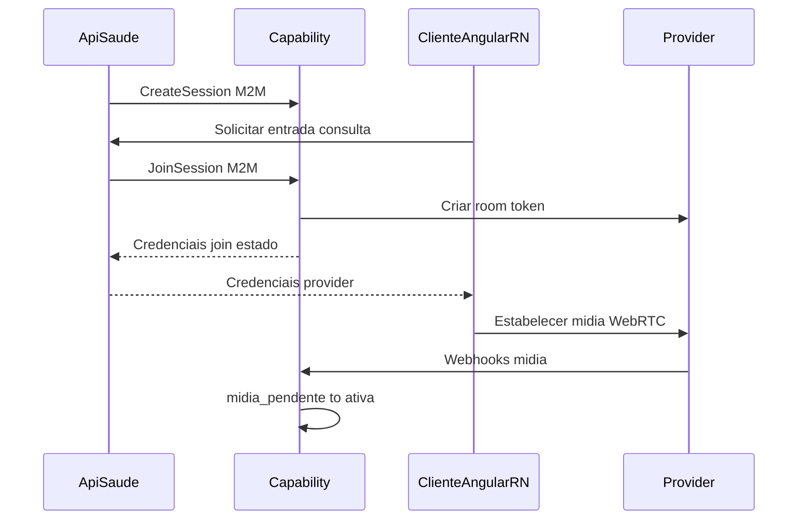
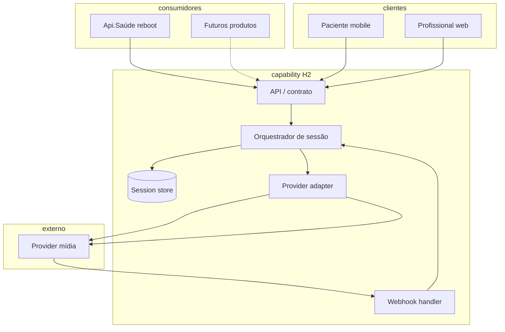
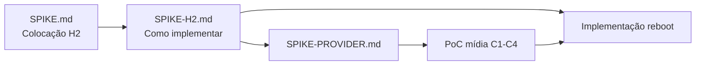

# Spike H2 — Como implementar a capability de videoconsulta

> **Objetivo:** definir **como** construir e operar a capability desacoplada de videoconsulta (H2) — contrato, colocação, integração com consumidores e clientes. **Não** é spike de provider (Twilio vs GetStream vs outros); isso vem após ou em paralelo controlado.
>
> **Pré-requisitos:** [SPIKE.md](./SPIKE.md) (decisões arquiteturais) · [GLOSSARIO.md](./GLOSSARIO.md) · [ADR-001](./docs/adr/ADR-001-colocacao-videoconsulta.md)

---

## 0. Herança da spike anterior (já decidido)

Não rediscutir — usar como restrições de design.

| Decisão | Referência |
|---------|------------|
| H2 — capability desacoplada; H1/legado rejeitados | [SPIKE §1](./SPIKE.md#1-perguntas-que-a-spike-deve-responder) |
| Capability = fonte da verdade do estado da sessão | [SPIKE §3.2.1](./SPIKE.md#321-fonte-da-verdade-do-estado-da-sessão) |
| Estados: `criada` → `aguardando` → `mídia_pendente` → `ativa` → `encerrada` / `vetada` | [SPIKE §7](./SPIKE.md#7-diagrama-de-estados) |
| C3 híbrido; grace period adiado | [SPIKE §3.2.2](./SPIKE.md#322-política-de-reconexão-c3) |
| C4: médico veta; paciente tardio não entra | [SPIKE §0.5](./SPIKE.md#c2-c4-e-migração-decisões-complementares) |
| C2: timeout/encerramento = regra do **consumidor** | [SPIKE §0.5](./SPIKE.md#c2--no-show--lobby) |
| Cutover com reboot Api.Saúde; não integrar no legado | [SPIKE §0.5](./SPIKE.md#migração-twilio--go-rooms) |
| Gravação fora de escopo | [SPIKE §0.4](./SPIKE.md#fora-de-escopo-mvp--spike) |
| PoC **não** valida desencontros do legado | [SPIKE §9](./SPIKE.md#9-escopo-do-poc-futuro-fase-pós-spike-arquitetural) |
| Chat no **Dr Clin** (Api.Saúde **não** usa) — **não** estender como base de vídeo; refatoração condicional se vídeo for adicionado ao Dr Clin | [SPIKE §0.1](./SPIKE.md#getstream-chat-vs-vídeo-h3) |

**Primeiro consumidor:** Api.Saúde rebootada. **Clientes de mídia:** paciente mobile-first (React Native); profissional/backoffice desktop+responsivo (Angular).

**Stack do time (familiaridade):** backend **Node.js / NestJS**; web **Angular**; mobile **React Native** — ver [SPIKE §0.6](./SPIKE.md#familiaridade-do-time-stack).

**Decisões levantadas (Q&A H2):**

| Tópico | Resposta | Implicação |
|--------|----------|------------|
| Stack Api.Saúde reboot (consumidor) | **Provavelmente** NestJS + Angular + React Native — alinhada ao time | Consumidor e capability podem compartilhar stack; contrato M2M continua necessário |
| Stack capability H2 | **NestJS** confirmado | §3.2 |
| Time de plataforma | **Sim** — mas **não** existe produto “plataforma” que sustenta os demais | Time pode **operar** capability dedicada; H2-C como “suite de plataforma” **não** se aplica — ver §2.1 |
| Backoffice na sala de vídeo | **Não** — sala sempre **1:1** (médico + paciente) | Backoffice = **observabilidade/suporte** fora da sessão de mídia; fora do MVP de join |
| Auth M2M consumidor | Abordagem validada no mercado; **provavelmente JWT + API keys** | §3.7 — detalhar em workshop segurança |

---

## 1. Perguntas que esta spike deve responder

| # | Pergunta | Resposta | Evidência | Status |
|---|----------|----------|-----------|--------|
| 1 | **Colocação:** serviço dedicado, módulo deployável ou biblioteca compartilhada? | **Inclinação H2-A′** — microserviço NestJS dedicado, operado pelo time plataforma; H2-C descartado como org.; H2-B/híbrido só se prazo reboot inviabilizar A′ | §2.2, §3.1 | 🟡 Parcial — confirmar em workshop |
| 2 | **Contrato:** quais APIs/comandos a capability expõe aos consumidores? | Operações §3.3; **fluxo JoinSession:** inclinação **cliente → Api.Saúde → capability** (comandos negócio sempre via consumidor) | §3.3, §3.3.1 | 🟡 Parcial |
| 3 | **Estado:** onde persiste sessão e transições (DB, cache)? | | | 🔴 Aberto |
| 4 | **Clientes:** como recebem atualizações de estado (poll, SSE, WebSocket)? | | | 🔴 Aberto |
| 5 | **Provider:** como abstrair Twilio/outro (adapter, webhooks, tokens)? | `IVideoProvider` + vendor em [SPIKE-PROVIDER §7](./SPIKE-PROVIDER.md#7-interface-ivideoprovider-rascunho); decisão vendor em [ADR-003](./docs/adr/ADR-003-provider-videoconsulta.md) | SPIKE-PROVIDER | 🟡 Parcial — PoC pendente |
| 6 | **Auth:** como consumidor e participantes autenticam na capability? | Consumidor: **JWT + API keys** (M2M). Participante: token curto emitido na join — detalhar | Q&A time | 🟡 Parcial |
| 7 | **Front-end:** SDK compartilhado, módulo por app ou integração direta? | Backoffice **sem join** na sala (só médico + paciente) | Produto | 🟡 Parcial |
| 8 | **Operação:** deploy, observabilidade, ownership — quem roda o quê? | **H2-A′:** time plataforma opera capability; time Api.Saúde reboot integra como consumidor | §2.2, §3.8 | 🟡 Parcial — confirma com colocação |
| 9 | **MVP H2:** qual fatia mínima entregável com o reboot? | | | 🔴 Aberto |

---

## 2. Hipóteses de implementação

| ID | Hipótese | Descrição | Quando favorece |
|----|----------|-----------|-----------------|
| **H2-A′** | **H2-A + time plataforma** — microserviço NestJS dedicado operado por plataforma; contrato M2M | Reuso + ownership; **inclinação atual** (§2.2) |
| **H2-B** | **Módulo / bounded context no reboot** | Capability como serviço ou módulo no mesmo ecossistema de deploy, contrato público interno | Time único no reboot; menos overhead operacional inicial |
| **H2-C** | **Platform capability compartilhada** | Capability pensada como **infra transversal** reutilizável — padrão alvo de modalidade realtime | Reuso multi-produto desde o design; **requer** produto/camada de plataforma madura |

#### Time de plataforma ≠ produto plataforma (§2.1)

**Contexto levantado:** existe **time de plataforma**, porém **não** existe hoje um **produto “plataforma”** (suite, portal ou backbone único) que sustente Api.Saúde, Dr Clin e demais produtos.

| O que existe | O que **não** existe |
|--------------|----------------------|
| Time de plataforma (engenharia transversal) | Produto plataforma unificado |
| Objetivo de reuso no PRD (H2) | Catálogo maduro de capabilities consumíveis “de prateleira” |

**Implicação para H2-A / B / C:**

- **H2-C (como organização):** pressupõe uma **camada de plataforma** onde capabilities vivem juntas — **premissa fraca** hoje. Não confundir “desenho reutilizável” com “já temos produto plataforma”.
- **H2-A + ownership plataforma:** candidata **mais realista** — microserviço `videoconsulta` **dedicado**, operado pelo time de plataforma, contrato HTTP/events; Api.Saúde é primeiro consumidor. Reuso via **contrato estável**, não via suite existente.
- **H2-B:** ainda viável se reboot e capability forem entregues pelo **mesmo programa** com fronteira de contrato clara — risco de parecer “parte da Api.Saúde” e dificultar reuso.

**Leitura recomendada:** buscar **desacoplamento e contrato de H2-C** com **deploy e ownership de H2-A** operado pelo time de plataforma — **híbrido H2-A′** (serviço dedicado, time plataforma, sem produto plataforma pré-existente).

**Nota:** H2-A, H2-B e H2-C podem convergir — ex.: **H2-A′** (serviço dedicado + time plataforma + contrato público interno). **Lição do Dr Clin:** nascer com contrato consumidor × capability evita refatoração futura se outra modalidade for adicionada depois ao mesmo produto.

#### Trade-offs de colocação (§2.2)

Comparativo para fechar pergunta **#1**. Escala nas matrizes §3.1: **Forte** / **Médio** / **Fraco**. H2-A′ = H2-A + ownership do time plataforma.

| Opção | O que é | Principais vantagens | Principais trade-offs |
|-------|---------|---------------------|----------------------|
| **H2-A′** | Microserviço NestJS `videoconsulta`; deploy próprio; time plataforma opera; Api.Saúde consome M2M | Reuso multi-produto; ownership claro; deploy independente; alinhado à lição Dr Clin; encaixa org. (time plataforma **sem** produto plataforma) | Mais setup (repo, CI/CD, observabilidade); overhead SRE; coordenação entre times; contrato precisa ser disciplinado desde o MVP |
| **H2-B** | Módulo/bounded context no mesmo deploy/programa do reboot Api.Saúde | Time-to-MVP mais rápido; menos bootstrap SRE; mesmo release train no cutover | Reuso frágil; risco de acoplamento (padrão Dr Clin); deploy acoplado; ownership confuso; extração futura cara |
| **H2-C** | Capability em camada “produto plataforma” Clin&Co | Melhor reuso conceitual; governança centralizada | **Premissa fraca hoje** (sem produto plataforma); over-engineering para ~20/dia; na prática converge para A′ |
| **Híbrido B→A′** | Módulo no reboot no MVP; extrair serviço depois | Velocidade no go-live; contrato amadurece com uso | Dívida técnica; reuso adiado; risco de refatoração que não acontece; dois big-bangs |

**Recomendação (pendente confirmação em workshop):** **H2-A′** — alinhada ao PRD (reuso), time plataforma existente e §2.1. Escolher **H2-B** ou **híbrido** somente se prazo do reboot **inviabilizar** serviço dedicado no MVP; nesse caso, usar critérios §2.3.

**H2-C:** manter apenas como **princípio de design** (contrato reutilizável), não como opção organizacional distinta.

#### Critérios de extração — se H2-B ou Híbrido (§2.3)

Aplicável **somente** se pergunta #1 fechar em H2-B ou híbrido. Objetivo: evitar “refatoração someday” sem critério (lição Dr Clin).

| Critério de extração | Gatilho |
|---------------------|---------|
| Segundo consumidor confirmado | Outro produto Clin&Co (ex.: Dr Clin) precisa integrar videoconsulta |
| Deploy acoplado bloqueia correção | Hotfix de vídeo exige redeploy da Api.Saúde inteira com frequência inaceitável |
| Ownership disputado | Incidentes de sessão/mídia sem dono claro entre produto e plataforma |
| Prazo acordado | Data alvo documentada no programa de reboot (ex.: +N meses pós go-live) |

**Pré-requisitos antes da extração:**

- Contrato HTTP interno **já público** (operações §3.3) — zero import direto entre módulos
- Persistência de sessão em boundary isolável (schema/DB separável)
- Auth M2M consumidor já implementado (mesmo que in-process vire rede)
- Owner da extração: **time plataforma**

**Entregável na decisão B/híbrido:** data alvo ou gatilho + owner + checklist acima assinados no ADR-002.

---

## 3. Dimensões de avaliação

### 3.1 Colocação e deploy

| Critério | Peso (1–3) | H2-A′ | H2-B | H2-C | Híbrido | Notas |
|----------|------------|-------|------|------|---------|-------|
| Reuso entre produtos Clin&Co | 3 | Forte | Fraco | Forte* | Fraco→Médio | Objetivo do PRD |
| Time-to-MVP com reboot | 3 | Médio | Forte | Fraco | Forte→Médio | ~20 consultas/dia |
| Deploy independente | 2 | Forte | Fraco | Forte | Fraco→Forte | |
| Overhead operacional (SRE) | 2 | Médio | Forte | Fraco** | Médio | |
| Clareza de ownership | 2 | Forte | Fraco | Forte* | Fraco | Time plataforma |
| Aderência à stack do time (NestJS, Angular, RN) | 2 | Forte | Forte | — | Forte | [SPIKE §0.6](./SPIKE.md#familiaridade-do-time-stack) |

\* H2-C só com produto plataforma — **não é o caso hoje** (§2.1)  
\*\* H2-C barato depois de construído, mas **custo de criar plataforma** é alto

### 3.2 Stack e implementação

| Camada | Stack preferencial | Notas |
|--------|-------------------|-------|
| Capability (API, orquestração, adapter) | **NestJS** / Node.js | Familiaridade do time; webhooks e REST/gRPC |
| Cliente web (profissional, backoffice) | **Angular** | Desktop + responsivo |
| Cliente mobile (paciente) | **React Native** | Mobile-first; C3 crítico |
| Consumidor (Api.Saúde reboot) | **NestJS** (provável) + Angular + RN | Mesma stack do time; integração M2M com capability |

**Provider:** avaliar SDK server-side Node + client web/mobile nas stacks acima antes de fixar vendor.

### 3.3 Contrato da capability (rascunho para avaliar)

Operações mínimas derivadas do diagrama de estados e C1–C4:

| Operação | Quem chama | Descrição |
|----------|------------|-----------|
| `CreateSession` | Consumidor (Api.Saúde) | Cria sessão (`criada`); associa `consultaId` externo |
| `JoinSession` | Cliente via consumidor ou direto | Emite credencial; transiciona para `aguardando` / `mídia_pendente` |
| `GetSession` | Consumidor / cliente | Lê estado atual (nunca fonte da verdade no cliente) |
| `EndSession` | Consumidor | Encerra (`encerrada`) |
| `VetoSession` | Consumidor (médico/C4) | Transiciona para `vetada` |
| `ConfigureLobbyPolicy` | Consumidor (C2) | Timeout, quem pode encerrar — **política do consumidor** |
| Webhooks provider | Provider → capability | Eventos de mídia; drive `mídia_pendente` → `ativa` |

**Avaliar:** REST vs gRPC; sync vs eventos de domínio; versionamento do contrato.

#### Fluxo JoinSession — quem chama o quê (§3.3.1)

Pergunta **#2** derivada: clientes Angular/RN falam com capability **direto** ou **sempre via Api.Saúde**?

| Opção | Fluxo | Vantagens | Trade-offs |
|-------|-------|-----------|------------|
| **A — Via Api.Saúde (BFF)** | Cliente → Api.Saúde → capability (`JoinSession`); Api.Saúde devolve credenciais provider + estado | Auth de usuário centralizada no consumidor; clientes só conhecem Api.Saúde; alinhado a C2/C4 no negócio | Latência extra; Api.Saúde no caminho crítico de join/reconexão |
| **B — Direto na capability** | Cliente obtém **join token** curto (via Api.Saúde) → chama capability direto | Menor latência; menos carga no consumidor em reconexão C3 | Clientes precisam de SDK/config capability; auth participante mais complexa |
| **C — Híbrido (inclinação)** | **Comandos negócio** (`Create`, `End`, `Veto`, `ConfigureLobby`) sempre consumidor → capability M2M; **Join** cliente → Api.Saúde → capability no MVP; sync estado via Api.Saúde ou SSE capability (decidir em #4) | Separa negócio (Api.Saúde) de sessão/mídia (capability); MVP mais simples para clientes | Definir evolução para join direto se C3/latência exigir |

**Recomendação (pendente confirmação):** **Opção C** no MVP — join via Api.Saúde; reavaliar join direto na capability após PoC C3 mobile.

**Sequência alvo (MVP, opção C):**

---

### 3.4 Persistência e consistência

| Aspecto | Opções a avaliar | Decisão |
|---------|------------------|---------|
| Store de sessão | Postgres, Dynamo, Redis+DB | |
| Idempotência (`JoinSession`) | Chave por participante + sessão | |
| Correlação | `sessionId`, `consultaId`, `providerRoomId` | |
| Event log / audit trail | Necessário para C4 e suporte | |

### 3.5 Integração com clientes (3 superfícies)

| Cliente | Stack | Necessidade | Opções |
|---------|-------|-------------|--------|
| Paciente mobile | **React Native** | Join, estado, reconexão C3 | SDK provider RN + API capability; módulo `@clin/videoconsulta-mobile` |
| Profissional desktop | **Angular** | Join, veto, estado | SDK provider web + API capability; módulo Angular compartilhado |
| Backoffice | **Angular** | **Observabilidade/suporte** — **não entra** na sala de vídeo (máx. 2: médico + paciente) |

**Avaliar:** biblioteca `@clin/videoconsulta-client` (wrappers Angular + RN) vs integração direta provider SDK + capability API only. **Provider sem SDK RN ou web maduro** exige camada extra ou penaliza time-to-MVP.

### 3.6 Camada de provider (adapter)

| Responsabilidade | Capability | Adapter |
|------------------|------------|---------|
| Criar/destruir room | Orquestra | Executa no provider |
| Emitir token participante | Orquestra | Executa |
| Receber webhooks mídia | Processa → estado | Normaliza eventos |
| Confirmar mídia bidirecional | **Decide** `ativa` | Informa fatos |

**Avaliar:** interface `IVideoProvider` interna; um adapter por vendor no MVP.

### 3.7 Auth e segurança

| Fluxo | Decisão / a detalhar |
|-------|---------------------|
| Consumidor → capability | **JWT + API keys** (M2M) — padrão de mercado; validar com segurança/platform |
| Participante → join | Token curto emitido pela capability; scoped por sessão/role (médico/paciente) |
| Webhooks provider | Assinatura / secret |

### 3.8 Observabilidade e operação

| Item | Necessário no MVP? |
|------|-------------------|
| Logs correlacionados (`consultaId`, `sessionId`) | Sim |
| Métricas: sessões por estado, tempo em `mídia_pendente` | Sim |
| Alertas: sessão presa, webhook falhou | Sim |
| Runbooks C1–C4 | Paralelizar |

---

## 4. Arquitetura de referência (rascunho)

_Preencher e ajustar conforme hipótese escolhida — **inclinação H2-A′** (serviço dedicado; time plataforma opera; clientes join via Api.Saúde no MVP)._

---

## 5. MVP H2 — fatia mínima (proposta inicial)

Derivado do reboot + C1–C4. Refinar com o time.

| Incluir no MVP | Excluir / fase 2 |
|----------------|------------------|
| Create / Join / Get / End / Veto | Gravação |
| Estados até §7 validado | Grace period C3 (adiado) |
| 1 provider (escolha em spike/provider) | Multi-provider |
| Api.Saúde como único consumidor | Self-service multi-tenant consumidores |
| Anti-desencontro (`mídia_pendente`) | Valores C2 concretos (consumidor define depois) |
| Web + mobile join | Backoffice join na sala (observabilidade fora da mídia) |

---

## 6. Unknowns desta spike

| # | Unknown | Impacto | Como validar | Status |
|---|---------|---------|--------------|--------|
| 1 | Stack do **consumidor** Api.Saúde reboot | Provavelmente NestJS + Angular + RN — alinhada ao time | Engenharia reboot | 🟡 Parcial |
| 1b | Stack da **capability** H2 | **NestJS** confirmado | §3.2 | 🟢 Decidido |
| 2 | Existe time de plataforma / shared services? | **Sim** — time existe; **produto plataforma unificado não** | §2.1 | 🟢 Decidido — inclina **H2-A′** (serviço dedicado operado por plataforma) |
| 3 | Backoffice precisa join ou só observabilidade? | **Só observabilidade** — sala sempre médico + paciente | Produto | 🟢 Decidido |
| 4 | Padrão de auth M2M no ecossistema | **JWT + API keys** (provável); detalhar com segurança | Segurança / platform | 🟡 Parcial |
| 5 | Provider escolhido | PoC pass **GetStream + LiveKit** — escolha final pendente | [SPIKE-PROVIDER](./SPIKE-PROVIDER.md) | 🟡 PoC ok — decisão pendente |
| 6 | Colocação H2-A′ vs B vs híbrido | **Inclinação H2-A′** — §2.2, §3.1 | Workshop stakeholders | 🟡 Parcial |
| 7 | Fluxo JoinSession (cliente direto vs via Api.Saúde) | **Inclinação híbrido C** — join via Api.Saúde no MVP | §3.3.1 | 🟡 Parcial |

---

## 7. Definition of Done — spike H2 (implementação)

### A. Decisões obrigatórias

- [ ] Hipótese de colocação escolhida (H2-A / B / C ou híbrido documentado)
- [ ] Contrato público mínimo documentado (operações §3.3)
- [ ] Modelo de persistência de sessão
- [ ] Mecanismo de sync estado → clientes
- [ ] Interface de provider adapter
- [ ] Modelo de auth consumidor + participante
- [ ] Escopo MVP H2 fechado (§5)
- [ ] [ADR-002](./docs/adr/ADR-002-implementacao-h2.md) **Aceito**

### B. Entregáveis

- [ ] Diagrama de componentes validado (§4)
- [ ] Sequência JoinSession documentada (consumidor + 2 clientes + provider)
- [ ] Mapa de responsabilidades capability × consumidor × cliente × provider
- [ ] Lista de tarefas de implementação para o reboot (épico/backlog)

### C. Fora desta spike

- [x] Escolha final de vendor (pode informar adapter, não bloqueia contrato)
- [x] PoC de desencontros legado
- [x] Valores numéricos C2 / grace period C3

### D. Gate — liberar implementação quando

Itens **A** + **B** completos → iniciar desenvolvimento da capability no programa de reboot.

---

## 8. Relação com outras fases

| Fase | Documento |
|------|-----------|
| Colocação arquitetural | [SPIKE.md](./SPIKE.md) |
| **Implementação H2** | **Este documento** |
| Provider | [SPIKE-PROVIDER.md](./SPIKE-PROVIDER.md) |
| ADR colocação | [ADR-001](./docs/adr/ADR-001-colocacao-videoconsulta.md) |
| ADR implementação | [ADR-002](./docs/adr/ADR-002-implementacao-h2.md) |
| ADR provider | [ADR-003](./docs/adr/ADR-003-provider-videoconsulta.md) |

---

## Histórico

| Data | Autor | Alteração |
|------|-------|-----------|
| 2026-05-20 | | Criação da spike H2 — como implementar |
| 2026-05-20 | | §3.2 stack do time: NestJS, Angular, React Native; critérios de provider |
| 2026-05-20 | | Q&A: consumidor provável NestJS; capability NestJS; time plataforma sim; backoffice sem join; auth JWT+API keys |
| 2026-05-20 | | §2.1: time plataforma ≠ produto plataforma; inclina H2-A′ (serviço dedicado + ownership plataforma) |
| 2026-05-20 | | §2.2 trade-offs colocação; §3.1 matriz; §2.3 critérios extração B/híbrido |
| 2026-05-20 | | §3.3.1 fluxo JoinSession; inclinação join via Api.Saúde no MVP |
| 2026-05-21 | | §8: link SPIKE-PROVIDER + ADR-003; pergunta #5 / unknown provider parcial |
