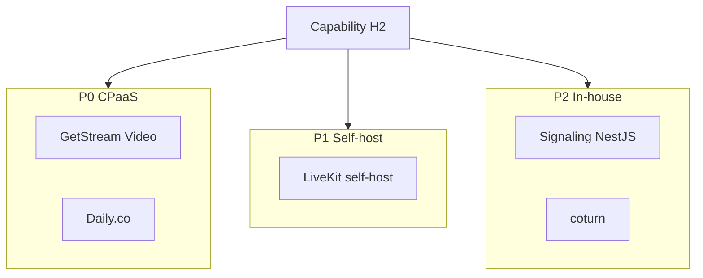
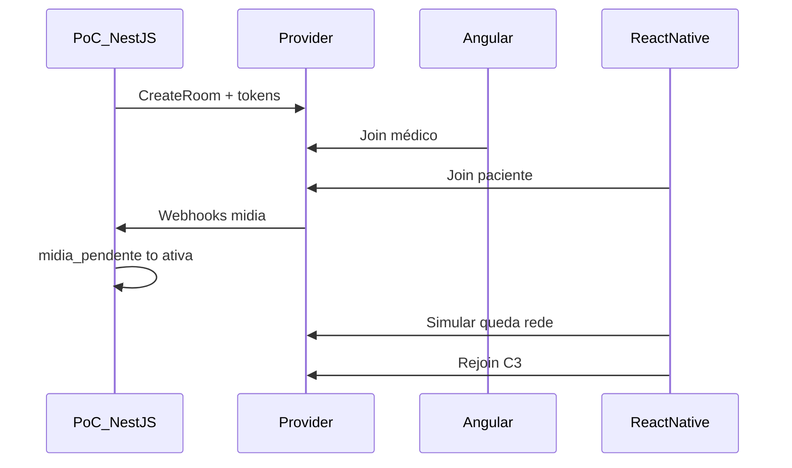
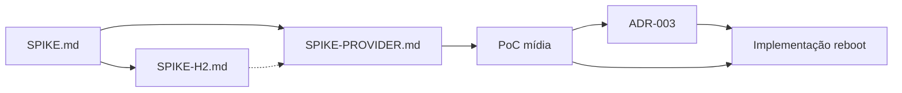

# Spike Provider — Escolha do provider de mídia (videoconsulta)

> **Objetivo:** definir **qual caminho de mídia 1:1** adotar no MVP — CPaaS gerenciado (**P0**), infra própria SFU self-host (**P1**) ou WebRTC in-house (**P2**) — no modelo H2 (capability orquestra estado; camada de mídia informa fatos), com evidência de desk research + PoC.
>
> **Pré-requisitos:** [SPIKE.md](./SPIKE.md) (decisões arquiteturais) · [SPIKE-H2.md](./SPIKE-H2.md) (implementação) · [Resumo executivo](./docs/SPIKE-RESUMO-EXECUTIVO.md) · [GLOSSARIO.md](./GLOSSARIO.md) · [ADR-001](./docs/adr/ADR-001-colocacao-videoconsulta.md)

---

## 0. Herança (não rediscutir)

| Decisão | Referência |
|---------|------------|
| H2 — capability desacoplada; provider = fatos de mídia | [SPIKE §3.2.1](./SPIKE.md#321-fonte-da-verdade-do-estado-da-sessão) |
| Anti-desencontro: `mídia_pendente` → `ativa` só com mídia bidirecional | [SPIKE §3.2.1](./SPIKE.md#321-fonte-da-verdade-do-estado-da-sessão) |
| C3 híbrido; grace period adiado | [SPIKE §3.2.2](./SPIKE.md#322-política-de-reconexão-c3) |
| Stacks: NestJS, Angular, React Native | [SPIKE §0.6](./SPIKE.md#familiaridade-do-time-stack) |
| ~20 consultas/dia, ~60 min, 1:1 fixo | [SPIKE §0](./SPIKE.md#0-contexto-levantado-qa) |
| PoC valida arquitetura **nova**; não reproduz legado | [SPIKE §9](./SPIKE.md#9-escopo-do-poc-futuro-fase-pós-spike-arquitetural) |
| H3 GetStream chat ≠ vídeo; ganho H3 limitado | [SPIKE §0.1](./SPIKE.md#getstream-chat-vs-vídeo-h3) |
| Migração: cutover reboot; Go Rooms = baseline legado | [SPIKE §3.8](./SPIKE.md#38-migração-desde-go-rooms-twilio) |
| Adapter provider na capability | [SPIKE-H2 §3.6](./SPIKE-H2.md#36-camada-de-provider-adapter) |

**Alerta mercado:** Twilio Programmable Video atingiu **EOL em dez/2024**. Go Rooms (legado Clin&Co) não é opção greenfield — apenas baseline de migração.

---

## 1. Perguntas que esta spike deve responder

| # | Pergunta | Resposta | Evidência | Status |
|---|----------|----------|-----------|--------|
| 1 | Quem entra na **shortlist**? | **GetStream Video**, **Daily.co**, **LiveKit** (Cloud + self-host P1) — ver §2.3 | §2.2, §4 | 🟢 Desk research |
| 2 | SDKs **NestJS + Angular + RN** viáveis? | Sim para shortlist; mediasoup/Janus com gap RN | §4 matriz | 🟢 Desk research |
| 3 | **Webhooks/eventos** para `mídia_pendente` → `ativa`? | GetStream e LiveKit: **confirmado** via webhooks no PoC (P2) | §4, §6.6 | 🟢 PoC |
| 4 | **C3** — mesma room + rejoin? | **Confirmado** nos dois finalistas (P4 RN Expo) | §6.6 | 🟢 PoC |
| 5 | **Custo** baseline / 2× / 10×? | Comparativo §5 — LiveKit Ship ~US$ 52/mês; GetStream HD ~US$ 108/mês (bruto) | §5 | 🟢 Estimativa pública |
| 6 | **Lifecycle de room** sem artifícios de custo? | Capability define política; provider executa TTL/destroy | ADR-003 | 🟡 Parcial |
| 7 | **Migração** vs Go Rooms? | Cutover no reboot; sem dual stack no legado | [SPIKE §3.8](./SPIKE.md#38-migração-desde-go-rooms-twilio) | 🟢 Decidido |
| 8 | **H3 GetStream** — ganho real? | Familiaridade vendor + possível conta; **não** reduz escopo H2 | §2.1 P0 | 🟢 Decidido |
| 9 | **Compliance** LGPD / residência? | Validar com segurança/jurídico por vendor | §6 unknowns | 🟡 Paralelizar |
| 10 | **MVP + plan B**? | **PoC A e B pass** — decisão final entre **GetStream** e **LiveKit Cloud**; Daily permanece plan C | ADR-003, §6.6 | 🟡 Escolha pendente |
| 11 | **Provider próprio** no prazo reboot? | **P1** LiveKit self-host viável em **staging Docker** (§2.5); go-live CPaaS no MVP; **P2** adiado | §2.4, §2.5 | 🟢 Desk research |
| 12 | Observabilidade mídia sem CPaaS? | **P1** LiveKit: webhooks + API; **P2**: build custom | §2.4 | 🟡 P1 ok; P2 alto esforço |
| 13 | **TCO** CPaaS vs self-host? | Baseline: CPaaS menor TCO total; 10×: reavaliar P1 | §5 | 🟢 Estimativa |

---

## 2. Hipóteses de provider e shortlist

### 2.1 Hipóteses P0 / P1 / P2

| ID | Hipótese | O que é | Quando favorece |
|----|----------|---------|-----------------|
| **P0** | CPaaS gerenciado | Vendor opera TURN/SFU; tokens + webhooks | Time-to-MVP reboot; ~20/dia; menor SRE WebRTC |
| **P1** | SFU self-host | LiveKit/mediasoup operado por nós | Soberania de dados; escala 10×; time plataforma + SRE |
| **P2** | WebRTC in-house | Signaling NestJS + coturn + P2P 1:1 | Volume alto / soberania extrema; **alto** risco prazo |

**Nota de volume:** custo por minuto **não domina** sozinho no MVP ([SPIKE §0](./SPIKE.md)); P1/P2 trocam OPEX variável por **engenharia + SRE fixo**.

**Lição legado:** separar política de custo (capability/consumidor) de mecanismo de mídia — sem gambiarras de lifecycle ([SPIKE §0](./SPIKE.md)).



### 2.2 Long list (varredura mercado — mai/2026)

| Candidato | Classe | SDK Node | SDK Angular/JS | SDK RN | Webhooks mídia | Notas |
|-----------|--------|----------|----------------|--------|----------------|-------|
| **GetStream Video** | P0 | `@stream-io/node-sdk` | JS SDK (Angular) | `@stream-io/video-react-native-sdk` | Sim | H3 ecossistema Dr Clin |
| **Daily.co** | P0 | REST + `@daily-co/daily-js` | daily-js | `@daily-co/react-native-daily-js` | Sim | Migrante comum pós-Twilio |
| **Amazon Chime SDK** | P0 | AWS SDK `@aws-sdk/client-chime-sdk-meetings` | `amazon-chime-sdk-js` | SDK **nativo** iOS/Android + [demo RN](https://github.com/aws-samples/amazon-chime-react-native-demo) — sem pacote RN maduro | EventBridge (lifecycle); mídia fina via client/API | **Long list only** — não shortlist (§2.3); ecossistema AWS |
| **LiveKit Cloud** | P0 | `livekit-server-sdk` | `livekit-client` | `@livekit/react-native` | Sim (webhooks) | Open core |
| **LiveKit self-host** | P1 | Mesmos SDKs | Mesmos | Mesmos | Sim | Docker/Compose; TURN embutido — ver §2.5 |
| **Vonage Video API** | P0 | Server SDK Node | OpenTok web | Opentok RN (legacy) | Session events | Maduro; RN menos “moderno” |
| **Agora** | P0 | `agora-token-service` etc. | Web NG | `react-native-agora` | Callbacks | Forte mobile |
| **Dyte** | P0 | REST | Web SDK | RN SDK | Webhooks | UI kits |
| **100ms** | P0 | Server SDK Node (**beta** — instável) | Web SDK (JS/Angular) | `@100mslive/react-native-hms` | Sim | **Eliminado** — knockout Node/NestJS (§2.3) |
| **Zoom Video SDK** | P0 | SDK | Web | Mobile SDKs | Parcial | Twilio recomenda pós-EOL |
| **Twilio Go Rooms** | Legado | — | — | — | — | **EOL / não greenfield** |
| **mediasoup** | P1 | Node lib | Integração manual | Sem SDK oficial RN | Custom | Alto esforço RN |
| **Janus** | P1 | Plugins | Integração manual | Limitado | Custom | Ops pesado |
| **WebRTC P2P + coturn** | P2 | Custom NestJS | `webrtc` / simple-peer | `react-native-webrtc` | **Build** | Anti-desencontro = projeto |

**Fontes públicas (desk research):** documentação oficial GetStream, Daily, LiveKit, [Amazon Chime SDK](https://docs.aws.amazon.com/chime-sdk/); [Twilio EOL Programmable Video](https://www.twilio.com/en-us/changelog/end-of-life-complete-for-unsupported-versions-of-the-programmable-video-sdk); pricing pages dos vendors (mai/2026).

**Knockout stack §0.6:** candidato sem SDK **server Node estável** para a capability NestJS sai da shortlist — ver ~~100ms~~ abaixo.

### 2.3 Shortlist (pós filtros knockout)

| Candidato | Motivo na shortlist |
|-----------|---------------------|
| **GetStream Video** | Stacks completas; H3; webhooks |
| **Daily.co** | Stacks completas; pricing transparente; pós-Twilio |
| **LiveKit Cloud** | P0 com caminho P1 self-host; OSS |
| **LiveKit self-host (P1)** | Representante “provider próprio” sem reinventar WebRTC |
| ~~100ms~~ | Eliminado shortlist: **Server SDK Node v2 em beta** — requisito capability **NestJS** exige SDK server maduro (knockout §0.6) |
| ~~Amazon Chime SDK~~ | **Long list only** — não promovido à shortlist: AWS alinhado (server/web fortes); paciente **mobile-first** + C3 exigem RN maduro — Chime usa bridge nativa/demo, não SDK RN de produto como a shortlist |
| ~~Vonage~~ | Eliminado shortlist: SDK RN menos alinhado ao time vs shortlist atual |
| ~~Agora/Dyte/Zoom~~ | Eliminados: não superam shortlist no critério time-to-MVP + matriz §4 |
| ~~mediasoup/Janus~~ | Eliminados P1: gap RN e esforço > LiveKit self-host |
| ~~Twilio Go Rooms~~ | Eliminado: EOL / legado |
| ~~P2 in-house~~ | **Adiado** — spike técnica §2.4, fora PoC MVP |

### 2.4 Spike técnica P2 (in-house) — resumo

| Item | Estimativa | Risco |
|------|------------|-------|
| Signaling (NestJS, rooms, ICE) | 4–8 semanas | Alto |
| TURN/STUN (coturn, TLS, escala) | 2–4 semanas + SRE | Alto |
| Clientes Angular + RN (`react-native-webrtc`) | 4–6 semanas | C3 / desencontro |
| Eventos mídia bidirecional (anti-desencontro) | 2–4 semanas | **Crítico** — sem webhooks prontos |
| Operação (métricas, runbooks) | Contínuo | SRE dedicado |

**Recomendação desk research:** **P2 fora do MVP do reboot.** Reavaliar se volume > 10× baseline **e** requisito de soberania confirmado. **P1 (LiveKit self-host)** cobre “provider próprio” com SDKs maduros — preferir P1 a P2 no médio prazo.

### 2.5 LiveKit self-host — Docker e escopo operacional

Contexto levantado: o time **consegue rodar LiveKit com Docker**. A checklist genérica “SFU + TURN + TLS + observabilidade” da §6.5 **não** equivale a quatro projetos separados no caso LiveKit.

| Componente | O que a spike exigia (leitura conservadora) | Com LiveKit + Docker/Compose |
|------------|---------------------------------------------|------------------------------|
| **SFU** | Deploy dedicado | **Imagem oficial** + `config.yaml` + Redis (muitas vezes no mesmo compose) |
| **TURN** | coturn separado | **TURN embutido** no servidor LiveKit — config (domínio, portas UDP, `use_external_ip` na AWS), não outro produto obrigatório |
| **TLS** | Certificados | **Ainda necessário** em staging/prod real (WSS): reverse proxy (Nginx/Caddy/**ALB**) ou TLS no LiveKit — PoC local pode simplificar; **mobile C3 exige** ambiente com TLS e UDP expostos corretamente |
| **Observabilidade** | Métricas + runbooks | **PoC:** logs + healthcheck bastam; **produção:** métricas/alertas (escala ~20/dia permite começar enxuto) |

**Referência:** [LiveKit — self-hosting deployment](https://docs.livekit.io/transport/self-hosting/deployment/).

**Implicação para a matriz §4:** com Docker na AWS (security groups, DNS, faixa UDP RTC), **time-to-MVP** e **operação** de LiveKit self-host sobem de “projeto greenfield” para **Médio** (não necessariamente **Forte** como CPaaS). **Não** substitui PoC de SDK/webhooks/C3 — mesmos clientes que LiveKit Cloud.

**PoC self-host (opcional):** se PoC **B (Cloud)** passar, validar **staging** com compose na AWS reutiliza a mesma integração NestJS/Angular/RN — ver §6.1.

---

## 3. Critérios e pesos

Escala na matriz §4: **Forte** / **Médio** / **Fraco** / **?** (PoC).

| Critério | Peso (1–3) | Notas |
|----------|------------|-------|
| Anti-desencontro (eventos mídia) | 3 | Webhooks track/participant |
| C3 reconexão mobile | 3 | PoC RN obrigatório |
| Aderência stack §0.6 | 3 | Knockout |
| Custo variável (participant-min) | 2 | §5 |
| Time-to-integração MVP | 2 | |
| Operação / observabilidade | 2 | |
| Lock-in / portabilidade (`IVideoProvider`) | 2 | |
| H3 GetStream | 1 | Não decisivo sozinho |
| Migração vs Go Rooms | 2 | |
| Custo fixo SRE/infra (P1/P2) | 2 | TCO |
| Soberania de dados | 2 | P1/P2 |
| Risco operacional WebRTC | 3 | P2 Fraco; P1 Médio |

---

## 4. Matriz comparativa (desk research)

_Pesos: ver §3. “?” = validar no PoC._

| Critério (peso) | GetStream Video P0 | Daily.co P0 | LiveKit Cloud P0 | LiveKit self-host P1 |
|-----------------|-------------------|-------------|------------------|----------------------|
| Anti-desencontro (3) | Forte — webhooks call | Forte — meeting events | Forte — participant/track webhooks | Forte — igual Cloud |
| C3 mobile (3) | Forte — PoC RN (P4) | ? — não PoC | Forte — PoC RN (P4) | ? — mesmo SDK |
| Stack §0.6 (3) | Forte | Forte | Forte | Forte |
| Custo variável (2) | Médio — ~US$ 108/mês HD baseline (bruto) | Médio — ~$0.004/min | **Forte** — ~US$ 52/mês Ship baseline | Fraco variável — custo fixo infra |
| Time-to-MVP (2) | Forte — H3 + docs | Forte | Forte | Médio — **Docker/Compose** reduz bootstrap vs P1 genérico (§2.5) |
| Operação (2) | Forte — SaaS | Forte | Forte | Médio — on-call; observabilidade mínima ok no MVP baixo volume |
| Lock-in (2) | Médio | Médio | Forte — OSS + Cloud | Forte — OSS |
| H3 (1) | Forte | Fraco | Fraco | Fraco |
| Migração Go Rooms (2) | Médio — net-new | Médio | Médio | Médio |
| SRE/infra fixo (2) | Forte (baixo) | Forte | Forte | Médio — VM/compose AWS; TLS/proxy; menos que coturn+P2 |
| Soberania (2) | Médio | Médio | Médio | Forte |
| Risco ops WebRTC (3) | Forte | Forte | Forte | Médio |

**Síntese pós-PoC (mai/2026):**

- **GetStream Video (A):** pass em P1–P6; melhor alinhamento H3 + stacks; **custo HD baseline maior** que LiveKit Ship (~US$ 108 vs ~US$ 52/mês, bruto).
- **LiveKit Cloud (B):** pass em P1–P6; **menor OPEX no baseline**; caminho **P1 self-host** sem trocar SDKs; OSS reduz lock-in.
- **Daily.co:** plan C se decisão exigir terceiro vendor — não executado (A e B pass).
- **~~100ms~~:** eliminado — SDK server Node em beta (§0.6).
- **LiveKit self-host (P1):** opcional pós go-live — PoC Cloud pass; staging Docker (§2.5).
- **P2 in-house:** adiado (§2.4).

**Decisão MVP:** ambos finalistas **atendem requisitos obrigatórios** — escolha entre GetStream e LiveKit Cloud com base em custo, H3, lock-in e operação (§6.7).

---

## 5. Modelo de custo (paramétrico)

Variáveis herdadas de [SPIKE.md §3.5](./SPIKE.md#35-viabilidade-financeira-modelo-paramétrico):

| Variável | Valor |
|----------|-------|
| `N_dia` | 20 |
| `T_med` | 60 min |
| `P_sess` | 2 participantes |
| Consultas/mês | 600 |
| Minutos de consulta/mês | 36.000 |
| **Participant-minutes/mês** (se 100% realizadas) | **72.000** |

**Fórmula:**

```
Custo_mensal ≈ N_dia × 30 × (
  (1 - P_no_show) × T_med × P_sess × custo_participant_minuto
  + ...
)
```

### Premissas de pricing (público mai/2026)

| Provider | Unidade de cobrança | Tarifa de referência |
|----------|---------------------|----------------------|
| **GetStream Video** | participant-minute × qualidade | SD: US$ 0,75 / 1k min · HD: US$ 1,50 / 1k min ([pricing guide](https://getstream.io/video/docs/api/pricing-guide/)) |
| **LiveKit Cloud (Ship)** | WebRTC minutes + downstream bandwidth | Plano US$ 50/mo; 150k WebRTC min incl.; US$ 0,0005/min excedente; US$ 0,12/GB bandwidth ([pricing](https://livekit.com/pricing)) |
| **LiveKit Cloud (Build)** | Idem | Plano US$ 0; 5k WebRTC min incl. |
| **Daily.co** (plan C) | participant-minute | ~US$ 0,004/min vídeo+áudio |
| **LiveKit self-host (P1)** | infra fixa | ~US$ 150–400/mês + engenharia |

**Nota:** estimativas GetStream abaixo são **brutas** (sem crédito promocional de US$ 100/mês), para comparabilidade conservadora com LiveKit.

**Bandwidth LiveKit:** ~500 kbps/participante → ~270 GB/mês no baseline (72k participant-min).

### Comparativo OPEX — finalistas PoC (US$/mês, bruto)

| Cenário | Participant-min/mês | GetStream SD | GetStream HD | LiveKit Build | LiveKit Ship |
|---------|---------------------|--------------|--------------|---------------|--------------|
| **Baseline** (20/dia) | 72.000 | **54** | **108** | ~60 | **~52** |
| **2×** (40/dia) | 144.000 | **108** | **216** | ~128 | **~85** |
| **10×** (200/dia) | 720.000 | **540** | **1.080** | ~676 | **~629** |

_Fórmulas: GetStream = (participant-min ÷ 1.000) × tarifa; LiveKit Ship = US$ 50 + excedente WebRTC + excedente bandwidth._

### Leitura por volume

| Volume | Menor custo (finalistas) | Observação |
|--------|--------------------------|------------|
| Baseline | **LiveKit Ship** (~US$ 52) | GetStream HD ~2× mais caro; SD (~US$ 54) próximo do LiveKit |
| 2× | **LiveKit Ship** (~US$ 85) | GetStream SD (~US$ 108) ainda acima |
| 10× | **GetStream SD** (~US$ 540) vs LiveKit Ship (~US$ 629) | HD GetStream (~US$ 1.080) inviável vs LiveKit; gatilho **P1 self-host** |

**Outros (referência baseline):** Daily.co ~US$ 248/mês · LiveKit self-host (P1) ~US$ 150–400 fixo + engenharia · P2 in-house TCO >> CPaaS.

**Sensibilidades não modeladas:** no-show/lobby (C2), gravação, noise cancellation, crédito GetStream US$ 100/mês.

**Processo:** proposta com tabela acima → validação stakeholders (sem teto pré-definido).

---

## 6. PoC — escopo, finalistas e critérios

### 6.1 Finalistas (para execução)

| Slot | Candidato | Classe | Motivo |
|------|-----------|--------|--------|
| **A** | **GetStream Video** | P0 | Inclinação MVP; H3; matriz §4 |
| **B** | **LiveKit Cloud** | P0 (caminho P1) | Valida OSS/self-host futuro; C3 + webhooks |

**Plan B documentado (se A falhar PoC):** **Daily.co** (P0) — mesma matriz, menor dependência H3.

**PoC opcional — LiveKit self-host (Docker):** após PoC B (Cloud) **pass**, ou em **paralelo** se o time já opera compose na AWS — mesmo checklist §6.3 em **staging** (TLS + TURN configurados; não só localhost).

**Fora do PoC obrigatório:** P2 in-house (§2.4).

### 6.2 Sequência alvo



### 6.3 Provas e critérios de sucesso

| Prova | Prioridade | Pass |
|-------|------------|------|
| Mídia bidirecional antes de `ativa` | Alta | Orquestrador só transiciona com webhook/API provider |
| Reconexão C3 (RN, rede instável) | Alta | Mesma room/sessão provider; revalidação `mídia_pendente` |
| Veto C4 (mock) | Alta | Token/room invalidado após encerrar |
| NestJS + Angular + RN E2E | Alta | Join áudio/vídeo 1:1 |
| Sessão órfã / TTL | Média | Room encerra; sem custo fantasma |
| Paridade C1–C4 | Média | Checklist [SPIKE §9](./SPIKE.md#9-escopo-do-poc-futuro-fase-pós-spike-arquitetural) |

### 6.4 Implementação PoC

- Repositório/branch `poc-videoconsulta` (fora deste doc se código em repo separado).
- Orquestrador NestJS mínimo — **não** exige capability H2 completa.
- Resultados registrados neste §6 (tabela pass/fail) + atualização [ADR-003](./docs/adr/ADR-003-provider-videoconsulta.md).

### 6.5 Checklist operação P1 — LiveKit self-host

**PoC / staging (Docker)** — mínimo para validar paridade com Cloud:

- [ ] `docker compose` (ou equivalente) — servidor LiveKit + Redis
- [ ] `livekit.yaml` — API keys, domínio, **TURN embutido** habilitado
- [ ] TLS (proxy ou cert) + DNS público — **obrigatório** para teste RN em rede real (C3)
- [ ] AWS: security groups — TCP 7880/7881, UDP RTC (faixa doc LiveKit), UDP/TCP TURN
- [ ] Webhooks apontando para orquestrador NestJS

**Produção go-live** — além do acima:

- [ ] `use_external_ip` / IP público correto na nuvem
- [ ] Métricas e alertas básicos (sessões presas, falha webhook)
- [ ] Runbook sessão presa

_Não é pré-requisito montar **coturn** como projeto separado no primeiro passo com LiveKit._

### 6.6 Resultados PoC

Repositório: `poc-videoconsulta/` · Detalhes: [RESULTADOS-POC.md](./poc-videoconsulta/docs/RESULTADOS-POC.md)

| Prova | GetStream (A) | LiveKit (B) | Daily (plan C) |
|-------|---------------|-------------|----------------|
| P1 — Áudio+vídeo bidirecional | ✅ Pass | ✅ Pass | — |
| P2 — Webhook antes de `ativa` | ✅ Pass | ✅ Pass | — |
| P3 — UI não mostra ativa sem P2 | ✅ Pass | ✅ Pass | — |
| P4 — Rejoin C3 (RN Expo) | ✅ Pass | ✅ Pass | — |
| P5 — Rejoin bloqueado após encerrar (C4) | ✅ Pass | ✅ Pass | — |
| P6 — Sem sessão órfã | ✅ Pass | ✅ Pass | — |
| E2E NestJS + Angular + RN | ✅ Pass | ✅ Pass | — |

**Conclusão técnica:** ambos finalistas **supriram os requisitos obrigatórios** do projeto (P1–P6, stacks §0.6, anti-desencontro, C3, C4). Daily.co **não executado** — desnecessário após pass duplo.

### 6.7 Síntese para decisão de provider

| Fator | GetStream Video (A) | LiveKit Cloud (B) |
|-------|---------------------|-------------------|
| PoC obrigatório | ✅ Pass | ✅ Pass |
| Anti-desencontro (P2/P3) | ✅ | ✅ |
| C3 mobile (P4) | ✅ | ✅ |
| OPEX baseline (bruto) | ~US$ 108/mês (HD) | **~US$ 52/mês (Ship)** |
| H3 (ecossistema Dr Clin) | **Favorável** | Neutro |
| Lock-in / caminho P1 | Médio | **Forte** (OSS + self-host) |
| Inclinação desk research | MVP original | Plan B → **empatado pós-PoC** |

**Próximo passo:** stakeholders escolhem entre A e B (ou critérios de desempate documentados) → [ADR-003](./docs/adr/ADR-003-provider-videoconsulta.md) **Aceito** com provider nomeado.

---

## 7. Interface `IVideoProvider` (rascunho)

Contrato interno da capability H2 — um adapter por vendor no MVP.

```typescript
interface IVideoProvider {
  createRoom(sessionId: string, metadata?: Record<string, string>): Promise<{ providerRoomId: string }>;
  destroyRoom(providerRoomId: string): Promise<void>;
  createParticipantToken(
    providerRoomId: string,
    participantId: string,
    role: 'medico' | 'paciente',
    ttlSeconds: number,
  ): Promise<{ token: string; credentials?: unknown }>;
  getRoomState(providerRoomId: string): Promise<ProviderRoomSnapshot>;
  verifyWebhook(payload: unknown, signature: string): boolean;
  parseMediaEvents(payload: unknown): ProviderMediaEvent[];
}

type ProviderMediaEvent =
  | { type: 'participant_connected'; participantId: string }
  | { type: 'participant_disconnected'; participantId: string }
  | { type: 'track_published'; participantId: string; kind: 'audio' | 'video' }
  | { type: 'track_unpublished'; participantId: string; kind: 'audio' | 'video' };
```

A capability mapeia eventos → transições `mídia_pendente` / `ativa` ([SPIKE §3.2.1](./SPIKE.md)).

---

## 8. Unknowns

| # | Unknown | Impacto | Como validar | Status |
|---|---------|---------|--------------|--------|
| 1 | Mecanismo exato anti-desencontro por vendor | Alto | PoC §6.6 | 🟢 GetStream + LiveKit |
| 2 | C3 em RN (rede instável) | Alto | PoC §6.6 | 🟢 GetStream + LiveKit |
| 3 | LGPD / residência dados por vendor | Médio | Segurança + DPA | 🟡 |
| 4 | `P_no_show`, `P_recon` para custo fino | Baixo | Produto | 🟡 |
| 5 | LiveKit self-host no go-live vs +6m | Médio — Docker reduz esforço; gate = PoC Cloud + staging compose | Workshop SRE | 🟡 |

---

## 9. Definition of Done — spike provider

### A. Decisões obrigatórias

- [x] Hipóteses P0/P1/P2 documentadas
- [x] Shortlist + eliminados com motivo (§2)
- [x] Matriz comparativa desk research (§4)
- [x] TCO baseline §5
- [x] Spike técnica P2 — adiar MVP (§2.4)
- [x] Finalistas PoC nomeados (§6.1)
- [x] Rascunho `IVideoProvider` (§7)
- [x] PoC §6 executado (2 finalistas) — **pass A e B**
- [ ] [ADR-003](./docs/adr/ADR-003-provider-videoconsulta.md) **Aceito** — escolha final A vs B pendente

### B. Entregáveis

- [x] Este documento
- [x] ADR-003 criado
- [ ] Tabela §6.6 preenchida pós-PoC
- [ ] Proposta custo validada stakeholders

### C. Fora desta spike

- [x] Investigar desencontros legado
- [x] Gravação, grace period C3
- [x] Fechar SPIKE-H2 (colocação, persistência)

### D. Gate — liberar adapter MVP quando

PoC §6 **pass** nos critérios alta prioridade (✅) + ADR-003 **Aceito** com provider escolhido entre A e B.

---

## 10. Relação com outras fases



| Fase | Documento |
|------|-----------|
| Colocação arquitetural | [SPIKE.md](./SPIKE.md) |
| Implementação H2 | [SPIKE-H2.md](./SPIKE-H2.md) |
| **Provider** | **Este documento** |
| ADR colocação | [ADR-001](./docs/adr/ADR-001-colocacao-videoconsulta.md) |
| ADR implementação | [ADR-002](./docs/adr/ADR-002-implementacao-h2.md) |
| ADR provider | [ADR-003](./docs/adr/ADR-003-provider-videoconsulta.md) |

---

## Histórico

| Data | Autor | Alteração |
|------|-------|-----------|
| 2026-05-21 | | Criação SPIKE-PROVIDER — varredura, P0/P1/P2, matriz, custo, PoC planejado |
| 2026-05-21 | | Shortlist: GetStream, Daily, LiveKit; finalistas PoC A=GetStream B=LiveKit; P2 adiado |
| 2026-05-21 | | Inclusão **100ms** na long list — depois **eliminado** (Server SDK Node beta; knockout NestJS) |
| 2026-05-21 | | **Amazon Chime SDK** na long list only — não shortlist (AWS; RN via nativo/demo) |
| 2026-05-21 | | §2.5 LiveKit self-host + Docker; checklist §6.5; matriz/PoC opcional staging |
| 2026-05-26 | | PoC A (GetStream) e B (LiveKit) pass P1–P6; §5 comparativo de custos bruto; §6.7 síntese decisão |
