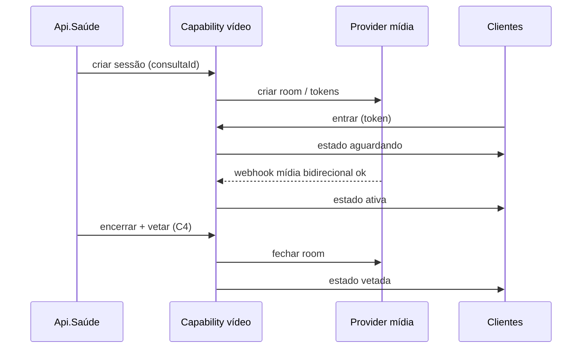
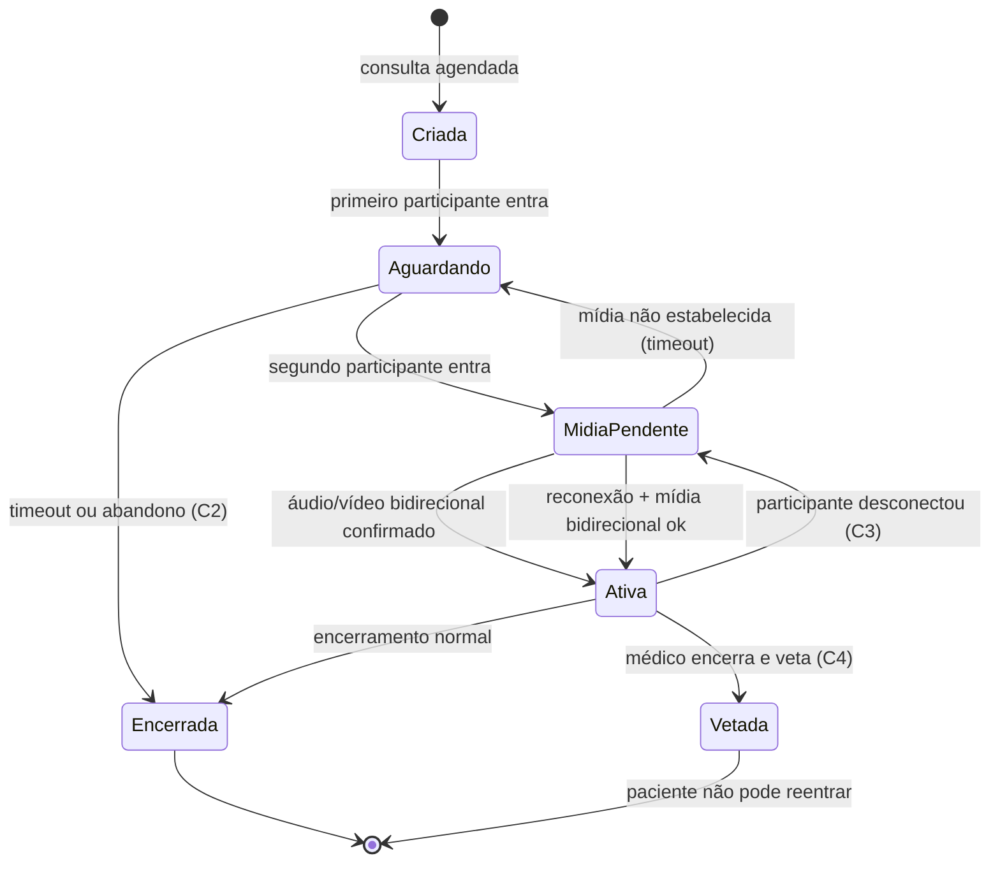

# Spike — Consultas online (Api.Saúde)

> **Objetivo desta spike:** definir critérios e evidências para escolher a **abordagem arquitetural** (não o provider/stack). Pesquisa de soluções e PoCs técnicos ficam para uma fase posterior.
>
> **Referência:** [PRD.md](./PRD.md)

---

## 0. Contexto levantado (Q&A)

Respostas coletadas que orientam a spike. Atualizar conforme novos dados.

| Pergunta | Resposta | Implicação para a spike |
|----------|----------|-------------------------|
| Quantos atendimentos por dia? | ~20/dia | Baseline de volume pequeno; custo direto de mídia não domina a decisão no MVP |
| Duração média? | ~60 min | Confirma C1; ~36.000 min de mídia/mês se 100% realizados |
| Participantes por chamada? | Sempre 2 (profissional + paciente) | Escopo **1:1 fixo** no MVP; sem salas multi-participante |
| Atendimentos em paralelo? | Sim, N em paralelo | Isolamento por sessão; concorrência modesta em escala absoluta |
| Budget aceitável? | Proposta primeiro → validação com stakeholders | Entregável financeiro é **proposta paramétrica**, não teto pré-definido |
| Plataformas? | Paciente: **mobile-first**; profissional e backoffice: **desktop + responsivo** | Clientes heterogêneos; C3 (reconexão) crítico no mobile |
| Realtime do ecossistema cobre vídeo? | **Não — apenas chat** (GetStream) | H3 não acelera escolha de stack de vídeo; reutilização limitada a práticas transversais |
| GetStream vídeo = habilitar função no chat? | **Não** — SDKs distintos; exige **módulo de vídeo novo** no backend e no frontend | Esforço de integração comparable a qualquer provider; ver §0.1 |
| Reutilizar solução acoplada atual? | **Não** — time não seguirá por H1 | Acoplamento, reuso inviável, desencontros, **manutenção arriscada** e artifícios técnicos por custo Twilio (§0) |
| O que é “desencontro”? | Médico e paciente **estão na chamada** (UI/estado indicam conexão), mas **não se veem nem se ouvem** | Falha de **mídia/conectividade**, não só de lobby; exige verificação explícita de par conectado e observabilidade |
| Reboot da Api.Saúde | Em andamento — videoconsulta é **capability core** | Core no legado **fugiria** da intenção do reboot; vídeo entra no programa via H2 (§0.2) |
| Quem entra primeiro na sala? | **Paciente pode entrar primeiro** (comportamento atual) — fica aguardando até o médico entrar para iniciar a consulta | Primeiro participante → `aguardando`; segundo → `mídia_pendente`; ver §0.3 |
| Gravação de vídeo | **Fora de escopo** | Spike e MVP não exigem gravação; ver §0.4 |

### Problema atual (solução acoplada legada)

A implementação existente (Go Rooms / Twilio acoplada à Api.Saúde) concentra regras de negócio, estado de sessão e integração de mídia no mesmo bloco. Consequências observadas:

- **Reuso inviável** entre produtos do ecossistema
- **Desencontros frequentes** — participantes aparentam estar na mesma consulta, mas o stream de áudio/vídeo não estabelece entre os dois
- **Debug difícil** — falta de fronteira clara entre estado de negócio, sinalização e mídia
- **Manutenção difícil e arriscada** — qualquer alteração carrega alto risco de regressão; o time evita mexer no que existe
- **Artifícios técnicos por custo Twilio** — workarounds introduzidos para contornar limitações/custo do Go Rooms (ex.: controle de tempo de sala, lifecycle de room, billing), aumentando complexidade acidental e fragilidade

**Relação custo × estabilidade (legado):**

Os artifícios técnicos ligados ao custo da Twilio tendem a **conflitar** com comportamento correto de sessão (C1–C4) — fechar sala cedo demais, reutilizar room de forma inconsistente ou lógica opaca de criação/destruição de sessão são candidatos a explicar desencontros e instabilidade. A nova abordagem (H2) deve separar **política de custo** (negócio/capability) de **mecanismo de mídia** (provider), sem gambiarras no fluxo principal.

**Hipóteses de causa do desencontro** (a validar no PoC, não confirmadas):

| Hipótese | Sintoma compatível |
|----------|-------------------|
| Participantes em salas/rooms diferentes com UI mostrando “conectado” | Não se veem/ouvem apesar de “na chamada” |
| Estado de sessão “ativa” sem peer connection WebRTC estabelecida | UI ok, mídia ausente |
| Reconexão parcial (um lado reconectou, outro não) | Assimetria áudio/vídeo |
| Token/credencial expirada ou inválida silenciosamente | Um lado conecta, outro não |

**Implicação para a spike:** a nova abordagem deve tratar **“sessão ativa”** e **“mídia estabelecida entre os dois participantes”** como condições distintas, com verificação e telemetria explícitas.

### GetStream: chat vs vídeo (H3)

O ecossistema já usa **GetStream para chat**, mas o vídeo **não** é extensão do que existe hoje:

| Aspecto | Chat (hoje) | Vídeo (GetStream ou outro) |
|---------|-------------|----------------------------|
| SDK | SDK de chat já integrado | **SDKs diferentes** — integração net-new |
| Backend | Módulo de chat existente | **Módulo de vídeo novo** (tokens, sessões, webhooks) |
| Frontend | UI/componentes de chat | **Módulo de vídeo novo** (paciente mobile + profissional desktop) |
| Habilitar feature | — | **Não** basta “ligar vídeo” no GetStream; é projeto de integração completo |

**O que H3 reutiliza de fato (ganho limitado):**

- Familiaridade do time com GetStream como vendor/contrato
- Possível reuso de conta/organização GetStream (se aplicável)
- Padrões transversais: auth, observabilidade, integração com providers externos

**O que H3 não reduz:**

- Esforço de backend e frontend da capability de vídeo
- Decisões de ciclo de sessão, desencontro, reconexão e orquestração (H2)

Ou seja: escolher GetStream Video na fase de provider **não encurta** a spike arquitetural — a capability desacoplada (H2) continua necessária independentemente do vendor.

### Reboot da Api.Saúde

A Api.Saúde está passando por **reboot** — reconstrução do núcleo do sistema com base arquitetural nova. Videoconsulta é **capability core** desse produto, não funcionalidade periférica.

**Critério de reboot:** capability core **não permanece no legado**. Manter vídeo na implementação acoplada atual (Go Rooms / Twilio) faria o reboot depender do pior pedaço do passado e contradiz a intenção de modernizar a plataforma.

| Papel | Reboot (alvo) | Legado (sair do caminho crítico) |
|-------|---------------|----------------------------------|
| **Api.Saúde rebootada** | Dona do negócio da consulta (agenda, autorização, regras C1–C4) | Implementação Twilio acoplada |
| **Capability de vídeo (H2)** | Nova — sessão, mídia, tokens, anti-desencontro; **parte do programa de reboot** | Artifícios de custo, desencontros, manutenção arriscada |

**Implicação:** H2 não é “extra” além do reboot — é como videoconsulta **entra** na nova Api.Saúde: Api.Saúde **consome** a capability via contrato estável; a capability **não** herda o acoplamento legado. Acoplar vídeo monoliticamente dentro da Api.Saúde rebootada (H1) repetiria o padrão que o reboot pretende eliminar.

### Ordem de entrada na sala (C1 / C2)

**Comportamento atual:** o **paciente pode entrar primeiro**. Enquanto o médico não entra, o paciente permanece em **`aguardando`**. A consulta **inicia** quando o médico entra (segundo participante) e a mídia bidirecional é confirmada.

| Fluxo | Sequência | Estado capability |
|-------|-----------|-------------------|
| **Atual (comum)** | Paciente entra → aguarda → médico entra → mídia ok → consulta ativa | `aguardando` → `mídia_pendente` → `ativa` |
| **Alternativo (PRD C1)** | Médico entra → aguarda → paciente entra → mídia ok → consulta ativa | Mesma máquina de estados — ordem de entrada **simétrica** |
| **C2 — no-show** | Um entra e o outro **não** entra → quem aguarda encerra ou timeout | `aguardando` → `encerrada` |

**Implicações:**

- A máquina de estados **não assume** médico como primeiro participante — `aguardando` = “1 de 2 presentes”.
- UX mobile (paciente): tela de espera explícita enquanto médico não entra.
- C2 relevante: **paciente aguardando médico** que não entra (além do inverso).
- C4: médico encerra após tempo limite mesmo se paciente nunca entrou ou já estava aguardando.

### Fora de escopo (MVP / spike)

| Item | Status | Implicação |
|------|--------|------------|
| **Gravação de vídeo** | ❌ Fora de escopo | Arquitetura MVP **não** precisa prever storage, playback, consentimento de gravação nem APIs de recording |
| Transcrição | ❌ Fora de escopo (implícito) | Mesmo raciocínio — não bloqueia escolha de provider na spike |
| 3º participante / salas multi-participante | ❌ Fora de escopo | MVP fixo em 1:1 (§0) |

**Nota:** a capability H2 pode evoluir no futuro para suportar gravação, mas **não é requisito** desta spike nem critério de decisão de provider/MVP.

**Ordem de grandeza (baseline):**

```
Consultas/mês           ≈ 20 × 30 = 600
Minutos de mídia/mês    ≈ 600 × 60 = 36.000  (100% realizadas, 2 participantes)
Min-participante/mês    ≈ 72.000             (2 × 60 min × 600 consultas)
```

---

## 1. Perguntas que a spike deve responder

| # | Pergunta | Resposta | Evidência | Status |
|---|----------|----------|-----------|--------|
| 1 | A capability de vídeo deve viver **acoplada à Api.Saúde** (H1) ou como **serviço/capability compartilhada** (H2)? | **H2 — capability desacoplada**, integrada ao **reboot** da Api.Saúde como consumidor. H1/legado **rejeitados** (§0, §0.2) | Decisão de time + reboot | 🟢 Decidido |
| 2 | Quem é a **fonte da verdade** do estado da sessão (criada, lobby, ativa, encerrada, vetada)? | **Capability de vídeo (H2)** — orquestra estados e transições. Api.Saúde = negócio da consulta (comandos). Provider = fatos de mídia (webhooks). Clientes **nunca** são fonte da verdade (§3.2.1) | Desencontro + H2 + 3 clientes | 🟢 Decidido |
| 3 | Reconexão (C3) é **mesma sessão técnica** ou **nova sessão com continuidade de negócio**? | **Modelo híbrido (§3.2.2):** mesma sessão de **negócio** na capability; **preferir** mesma room do provider; mídia **sempre** revalidada via `mídia_pendente`. Nova room só como fallback | Desencontro + mobile | 🟢 Decidido |
| 4 | O que são os **“desencontros”** hoje (sintoma, causa provável, impacto)? | **Sintoma:** médico e paciente na chamada, mas não se veem/ouvem. **Impacto:** consulta inviável. **Causa:** a confirmar no PoC (§0) | Produto / suporte | 🟡 Parcial — sintoma definido |
| 5 | Quanto de **prática operacional do ecossistema** (H3) se aplica a vídeo 1:1? | **Limitado:** chat GetStream não transfere integração de vídeo — SDKs distintos, módulos backend/frontend novos (§0.1). Reuso: familiaridade com vendor + práticas transversais (auth, observabilidade) | Confirmação engenharia | 🟢 Decidido |
| 6 | Qual **modelo de custo** escala de forma sustentável com o volume esperado? | Baseline parametrizado (§3.5); **aceitabilidade** depende de proposta + validação stakeholders | §0, §3.5 | 🟡 Parcial |
| 7 | Qual estratégia de **migração** desde Go Rooms (Twilio) é aceitável no MVP? | _Pendente_ | | 🔴 Aberto |

---

## 2. Hipóteses em avaliação

| ID | Hipótese | Resumo | Status |
|----|----------|--------|--------|
| H1 | Solução acoplada à Api.Saúde | Menor complexidade inicial; maior acoplamento e menor reuso | ❌ **Rejeitada** — legado, desencontros, manutenção arriscada, artifícios Twilio; **incompatível com reboot** (§0.2) |
| H2 | Capability desacoplada / shared | Maior reuso e evolução independente; maior custo inicial | ✅ **Direção escolhida** — capability core do reboot; Api.Saúde consome via contrato |
| H3 | Reaproveitar provider/ecossistema (GetStream) | Familiaridade com vendor; chat já integrado | ➖ **Ganho limitado** — vídeo exige SDKs e módulos novos (backend + frontend); não é habilitar feature |

**Nota:** H3 **não** significa estender a integração de chat. GetStream Video (ou qualquer provider) demanda **capability de vídeo net-new** — alinhada à H2 — com contrato próprio de sessão, tokens e clientes. A spike arquitetural (H2) precede e independe da escolha GetStream vs outro provider na fase seguinte.

---

## 3. Dimensões de avaliação

### 3.1 Requisitos por cenário (derivados do PRD)

| Cenário | Requisito funcional | Regra de negócio | Responsabilidade negócio | Responsabilidade vídeo | Critério de aceite (spike) |
|---------|---------------------|------------------|--------------------------|------------------------|----------------------------|
| **C1** | Médico e paciente em consulta ~60 min | Duração média **~60 min** confirmada; ambos podem encerrar? | | | Duração validada (§0) |
| **C2** | Um lado não entra | Timeout de espera; quem encerra; sessão órfã | | | |
| **C3** | Reconexão após queda | Modelo híbrido §3.2.2; grace period **adiado** | | | Arquitetura definida |
| **C4** | Médico encerra e veta paciente | Fim definitivo; paciente não reentra | | | |

### 3.2 Modelo de sessão e consistência

| Aspecto | Definição proposta | Risco se mal definido | Decisão |
|---------|-------------------|------------------------|---------|
| Estados da sessão | criada → aguardando → **mídia_pendente** → ativa → encerrada → vetada | Desencontros: UI “ativa” sem mídia | Capability H2 (§3.2.1) |
| Quem dispara transições | **Capability (H2)** como orquestrador; Api.Saúde emite comandos de negócio | Sessão presa, timeout errado, desencontro | Capability |
| Idempotência (duplo clique, refresh, 2 abas) | Capability deduplica entrada por participante/sessão | Duplicidade de participante / salas distintas | Capability |
| Concorrência (entrada simultânea, reconexão parcial) | N consultas em paralelo; 2 participantes fixos por sessão | Um lado “online”, outro não — **desencontro** | Isolamento por consulta |
| Correlação consulta ↔ sessão ↔ participante | IDs, logs, traces | Suporte e debug impossíveis | Capability + Api.Saúde |
| Verificação mídia estabelecida | Capability confirma áudio/vídeo bidirecional antes de `ativa` | Desencontro: na chamada mas sem ver/ouvir | **Requisito anti-desencontro** |
| Fonte da verdade | **Capability H2** (estado sessão); provider informa fatos de mídia | Estado divergente entre clientes | §3.2.1 |

### 3.2.1 Fonte da verdade do estado da sessão

**Decisão:** a **capability de vídeo (H2)** é a fonte da verdade dos estados `criada`, `aguardando` (lobby), `mídia_pendente`, `ativa`, `encerrada` e `vetada`.

| Papel | Fonte da verdade de… | Papel na sessão de vídeo |
|-------|----------------------|---------------------------|
| **Capability de vídeo (H2)** | Estado da sessão e transições | Orquestrador — persiste e expõe estado |
| **Api.Saúde** | Consulta de negócio (agendada, autorizada, realizada) | Consumidor — emite comandos (`criar sessão`, `encerrar`, `vetar`) |
| **Provider de mídia** | Fatos técnicos (room, participante conectou, publicou stream) | Informante — webhooks/API reconciliados pela capability |
| **Clientes** | — | **Nunca** fonte da verdade — apenas refletem estado (poll/SSE/WebSocket) |

**Transições por estado:**

| Estado | Quem dispara |
|--------|--------------|
| `criada` | Capability, sob comando da Api.Saúde |
| `aguardando` | Capability — **primeiro participante** entrou (comportamento atual: frequentemente o paciente) |
| `mídia_pendente` | Capability — **segundo participante** entrou (consulta “inicia” quando médico entra se paciente já aguardava) |
| `ativa` | Capability — **mídia bidirecional confirmada** (não basta “na sala”) |
| `encerrada` | Capability — timeout, abandono ou encerramento normal |
| `vetada` | Capability — comando da Api.Saúde (regra C4: médico encerra e veta paciente) |

**Anti-desencontro:** `ativa` exige confirmação de áudio/vídeo bidirecional. O provider envia eventos; a **capability decide** a transição `mídia_pendente → ativa`. Preferência: validar via webhooks/API do provider; fallback: sinais do cliente **validados** pela capability contra o provider.



**PoC pendente:** mecanismo exato de confirmação de mídia bidirecional por provider escolhido.

### 3.2.2 Política de reconexão (C3)

**Decisão:** modelo **híbrido** — nem “mesma sessão técnica cega” nem “nova sessão sempre”.

| Camada | Comportamento |
|--------|---------------|
| **Negócio** | Mesma consulta (`consultaId`) e mesmo `sessionId` na capability — continuidade de negócio **sempre** |
| **Capability** | Queda de participante → **não** manter `ativa` plena; transicionar para `mídia_pendente` (ou `reconectando`) até mídia bidirecional confirmada de novo |
| **Provider** | **Preferir** mesma room enquanto válida; token novo na reentrada; **nova room** apenas se a atual expirou ou falhou |
| **WebRTC** | Sempre reestabelecimento de mídia — nunca assumir peer connection contínua |

**Rejeitado:**

- Manter `ativa` durante queda parcial → reproduz desencontro (UI “ok”, mídia morta)
- Nova room/sessão provider a **cada** queda → fragmenta estado, billing e correlação; risco de salas distintas

**Fluxo resumido:**

1. Provider/capability detecta desconexão de um participante
2. Capability sai de `ativa` → `mídia_pendente` / `reconectando`
3. Participante retorna à **mesma room** (se válida) ou room nova (fallback)
4. Mídia bidirecional confirmada → `ativa`

**Adiado (não responder nesta rodada):**

- Duração do **grace period**
- Comportamento ao **expirar** grace period
- Quem permanece na room enquanto o outro reconecta (UX detalhada)

Esses itens **não bloqueiam** a decisão arquitetural acima; entram em rodada posterior de produto ou PoC.

### 3.3 Colocação arquitetural (H1 vs H2)

| Critério | Peso (1–3) | H1 | H2 | Notas |
|----------|------------|----|----|-------|
| Time-to-MVP | 2 | ✅ | ➖ | ~20/dia; escopo 1:1 simples |
| Reuso entre produtos Clin&Co | 3 | ❌ | ✅ | Objetivo explícito do PRD |
| Evolução / deploy independente | 2 | ❌ | ✅ | Vídeo é net-new vs chat |
| **Manutenibilidade / risco de regressão** | **3** | **❌** | **✅** | Legado: artifícios Twilio + medo de alterar |
| **Alinhamento ao reboot da Api.Saúde** | **3** | **❌** | **✅** | Core no legado fugiria da intenção do reboot (§0.2) |
| Clareza de ownership operacional | 2 | ➖ | ✅ | Capability dedicada facilita runbooks |
| Custo de contrato público antes do 2º consumidor | 1 | ✅ | ➖ | Volume baixo tolera contrato mínimo |

_Escala: ❌ = desfavorável · ➖ = neutro · ✅ = favorável._

### 3.4 Fronteira negócio × capability de vídeo

| Responsabilidade | Dono negócio (Api.Saúde) | Dono capability vídeo (H2) | Observação |
|------------------|--------------------------|----------------------------|------------|
| Agendamento / slot da consulta | ✅ | — | |
| Autorização de entrada (roles) | ✅ regra | ✅ enforce (tokens) | Api.Saúde autoriza; capability emite credencial |
| Limite de duração (~60 min) | ✅ regra | ✅ enforce técnico | |
| Encerramento e veto pós-fim (C4) | ✅ regra (médico) | ✅ transição `vetada` | Api.Saúde comanda; capability executa |
| Política de reconexão (C3) | ✅ regra | ✅ mecanismo | Modelo híbrido §3.2.2; grace period adiado |
| Emissão de credenciais/tokens de mídia | — | ✅ | |
| **Estado da sessão (fonte da verdade)** | — | ✅ | Api.Saúde consulta, não possui |
| Métricas para custo e SLA | ✅ atribuição | ✅ telemetria mídia | |

### 3.5 Viabilidade financeira (modelo paramétrico)

Preencher variáveis; valores numéricos podem ficar como placeholder até fase de provider.

| Variável | Símbolo | Valor estimado | Fonte / suposição |
|----------|---------|----------------|-------------------|
| Consultas por dia | `N_dia` | **20** | Q&A produto |
| Duração média real (min) | `T_med` | **60** | Q&A produto |
| Taxa de no-show (C2) | `P_no_show` | _pendente_ | Impacta custo de lobby |
| Taxa de reconexão por consulta | `P_recon` | _pendente_ | Crítico no mobile |
| Participantes médios por sessão ativa | `P_sess` | **2** (fixo) | Q&A produto |
| Minutos ociosos em lobby (C2) | `T_lobby` | _pendente_ | Depende de timeout de espera |

**Drivers de custo a mapear (qualquer abordagem):**

- [ ] Cobrança por minuto de mídia
- [ ] Cobrança por sessão/sala criada
- [ ] Cobrança por participante conectado
- [ ] Custo de sessão abandonada (C2)
- [ ] Impacto de reconexão (C3) — nova sessão vs continuidade
- [ ] Sensibilidade a pico horário

**Fórmula rascunho (ajustar conforme modelo escolhido depois):**

```
Custo_mensal ≈ N_dia × 30 × (
  (1 - P_no_show) × T_med × custo_minuto
  + P_no_show × T_lobby × custo_sessão_ociosa
  + (1 - P_no_show) × P_recon × custo_reconexão
)
```

| Cenário de volume | N_dia | Minutos mídia/mês | Custo mensal estimado | Observação |
|-------------------|-------|-------------------|----------------------|------------|
| Baseline | 20 | ~36.000 | _plugar `custo_minuto`_ | 600 consultas/mês |
| 2× baseline | 40 | ~72.000 | | |
| 10× baseline | 200 | ~360.000 | | Crescimento agressivo |

**Processo de budget:** elaborar proposta com a fórmula acima + cenários → stakeholders validam aceitabilidade (sem teto numérico pré-definido).

### 3.6 Capacidade operacional

| Item | Existe hoje? | Gap | Necessário para MVP? |
|------|--------------|-----|----------------------|
| Runbook: sessão presa | | | |
| Runbook: paciente não entra (C2) | | | |
| Runbook: falha de reconexão (C3) | | | |
| Runbook: encerramento / veto (C4) | | | |
| Suporte: localizar consulta por ID | | | |
| SLI: % sessões estáveis até o fim | | | |
| SLI: reconexão bem-sucedida em X min | | | |
| SLI: tempo máximo em lobby | | | |
| Alertas / dashboards | | | |

### 3.7 Flexibilidade e lock-in

| Critério | Importância (1–3) | Notas |
|----------|-------------------|-------|
| Troca de provider de mídia sem reescrever regras de consulta | | |
| Clientes heterogêneos (web, app, futuros produtos) | **3** | Paciente mobile-first; profissional/backoffice desktop+responsivo — SDK/contrato deve funcionar em ambos |
| Extensões futuras (transcrição, 3º participante) | **1** | Fora do MVP; gravação também **fora de escopo** (§0.4) |
| Onde aceitamos lock-in (mídia vs sinalização vs estado) | | |

### 3.8 Migração desde Go Rooms (Twilio)

| Item | Decisão / nota |
|------|----------------|
| Paridade mínima com C1–C4 antes de desligar legado | |
| Estratégia (feature flag, cohort, rollback) | |
| Comportamento aceitável **diferente** no MVP | Sem gravação de vídeo (§0.4) |
| Período de convivência dupla | |

---

## 4. Matriz de decisão (hipóteses × dimensões)

Legenda: **F** = favorece · **N** = neutro · **P** = prejudica · **?** = desconhecido

| Dimensão | H1 Acoplado | H2 Desacoplado | H3 Reuso ecossistema |
|----------|-------------|----------------|----------------------|
| Time-to-MVP | F | N | P (módulos vídeo novos mesmo com GetStream) |
| Reuso multi-produto | P | F | N |
| Consistência de sessão (C2–C4) | P | F | N |
| **Anti-desencontro (mídia estabelecida)** | **P** | **F** | N |
| Custo previsível em escala | N | N | N |
| Operação / suporte | P | F | N |
| **Manutenibilidade** | **P** | **F** | N |
| **Alinhamento reboot Api.Saúde** | **P** | **F** | N |
| Flexibilidade / lock-in | P | F | N (novo lock-in de vídeo) |
| Migração desde Twilio | P | F | N |

**Recomendação:**

> **Direção: H2 — capability desacoplada de videoconsulta**, como **parte do reboot** da Api.Saúde (capability core, não legado).
>
> **H1 rejeitada:** legado acoplado — desencontros, manutenção arriscada, artifícios Twilio — e **incompatível com reboot**: deixar videoconsulta no sistema legado faria a nova Api.Saúde continuar dependendo da base que se pretende substituir.
>
> **Modelo alvo:** Api.Saúde rebootada = negócio da consulta; capability H2 = sessão e mídia; legado Twilio = migrar e desligar.
>
> **Requisito derivado do desencontro:** distinguir **“participante na sessão”** de **“mídia bidirecional estabelecida”**. A consulta só transita para “ativa” quando ambos os participantes têm stream de áudio/vídeo confirmado — não basta estado de UI ou presença na sala.
>
> **H3 esclarecido:** GetStream hoje = **chat**. Vídeo (GetStream ou outro) = SDKs diferentes + módulos novos no backend e frontend — **não** é habilitar função no produto existente. Ganho de H3: familiaridade com vendor e práticas transversais; **não** reduz o escopo da capability H2.
>
> **Ainda exige decisão/PoC:** causa raiz dos desencontros, taxa de no-show, migração Twilio, confirmação de mídia bidirecional por provider, **grace period C3 (adiado)**.

---

## 5. Unknowns (bloqueadores e suposições)

| # | Unknown | Impacto se errado | Como validar | Responsável | Prazo | Status |
|---|---------|-------------------|--------------|-------------|-------|--------|
| 1 | Volume: consultas/dia, duração média, no-show | Modelo de custo e capacidade | Dados produto/ops | Produto | | 🟡 Parcial — falta no-show |
| 2 | Clientes: web, mobile, ambos | Contrato e SDK | Arquitetura frontend | Produto | | ✅ Resolvido (§0) |
| 3 | Quem inicia a sala (médico primeiro?) | **Paciente pode entrar primeiro** — aguarda médico; ordem simétrica na capability (`aguardando` = 1/2). Consulta inicia quando médico entra + mídia ok (§0.3) | Produto | | | ✅ Resolvido |
| 4 | Definição operacional de “desencontro” | Prioridade de reconexão/estado | Produto / suporte | | | 🟡 Parcial — sintoma definido; causa raiz pendente |
| 5 | Compliance (LGPD, retenção de metadados/logs) | Escopo MVP vs jurídico | Jurídico / segurança | | | 🔴 Aberto — **gravação fora de escopo** (§0.4) |
| 6 | SLA de produto (% reconexão, tempo lobby) | SLIs e arquitetura | Produto + SRE | | | 🔴 Aberto — grace period C3 **adiado** |
| 9 | Grace period e expiração na reconexão (C3) | Timeout, custo de room ociosa, UX pós-queda | Produto / PoC | | | ⏸️ **Adiado** — fora desta rodada |
| 7 | Gravação / auditoria no roadmap | Impacto arquitetura cedo | Produto | | | ✅ Fora de escopo (§0.4) |
| 8 | GetStream / realtime cobre vídeo? | Assumir H3 indevidamente | Produto / engenharia | | | ✅ Resolvido — chat only; vídeo = SDKs + módulos novos (§0.1) |

---

## 6. Checklist por cenário (validação da abordagem)

Use antes de qualquer PoC: a abordagem escolhida precisa **endereçar explicitamente** cada item.

### C1 — Médico e paciente conectados (~60 min)

- [ ] Fluxo simétrico: qualquer participante pode ser o primeiro em `aguardando` (atual: **paciente entra primeiro** e aguarda médico — §0.3)
- [ ] Consulta só `ativa` após segundo participante + mídia bidirecional confirmada
- [ ] Limite de duração definido (regra + enforcement)
- [ ] Ambos conseguem encerrar? (definir papel assimétrico se não)
- [ ] Encerramento limpa estado e métricas
- [ ] Correlação de logs consulta/sessão/participantes
- [ ] **Anti-desencontro:** consulta só “ativa” quando áudio e vídeo bidirecionais confirmados entre os dois participantes
- [ ] Telemetria: estado de mídia por participante (publicando, recebendo, falha)

### C2 — Um lado não entra

- [ ] Estado “aguardando” com timeout configurável (inclui **paciente aguardando médico** — fluxo atual)
- [ ] Quem pode encerrar sem atendimento
- [ ] Comportamento de sessão órfã (cleanup, billing)
- [ ] UX clara para o lado que entrou
- [ ] Métrica: taxa de no-show / abandono em lobby

### C3 — Reconexão

- [x] Política documentada: modelo híbrido — mesma sessão negócio, preferir mesma room, revalidar mídia (§3.2.2)
- [ ] Grace period e expiração — **adiado**
- [ ] Outro participante permanece na sala ou também reconecta? — **adiado** (UX)
- [ ] Sincronização de estado após reconexão (evitar desencontro)
- [ ] SLI: reconexão bem-sucedida em X minutos

### C4 — Médico encerra e veta paciente

- [ ] Transição para estado terminal (não reentrada)
- [ ] Apenas médico (ou regra explícita) dispara veto
- [ ] Paciente bloqueado após fim — técnico e de negócio
- [ ] Mensagem/UX para paciente tardio
- [ ] Auditoria do evento de encerramento

---

## 7. Diagrama de estados (rascunho)

Preencher e validar com produto/engenharia. Mermaid é editável conforme decisões.



_Estado `MidiaPendente` evita marcar consulta como ativa quando participantes estão “na chamada” mas sem se ver/ouvir (desencontro)._

**Decisões pendentes no diagrama:**

- [x] `MidiaPendente → Ativa`: capability confirma mídia bidirecional (webhooks provider; ver §3.2.1)
- [x] `Ativa → MidiaPendente` na reconexão: revalidar mídia; preferir mesma room (§3.2.2)
- [ ] Quem pode transicionar `Aguardando → Encerrada`?
- [ ] Comportamento ao expirar grace period — **adiado**
- [ ] `Vetada` impede qualquer reentrada ou só paciente?

---

## 8. Entregáveis desta fase

| Entregável | Status | Link / nota |
|------------|--------|-------------|
| Contexto Q&A documentado (seção 0) | ✅ | |
| Mapa cenário → requisito → dono (seção 3.1 + 3.4) | 🟡 | Fronteira negócio × vídeo parcialmente preenchida |
| Diagrama de estados validado (seção 7) | ⬜ | |
| Matriz H1/H2/H3 preenchida (seção 4) | ✅ | H1 rejeitada; H2 direção escolhida |
| Modelo de custo com variáveis (seção 3.5) | 🟡 | Baseline numérico; falta no-show e custo_minuto |
| Lista de unknowns resolvida ou escalada (seção 5) | 🟡 | #2, #3, #7, #8 resolvidos; #1 e #4 parciais |
| ADR de colocação arquitetural | ⬜ | Ver [ADR-001](./docs/adr/ADR-001-colocacao-videoconsulta.md) |
| Lista do que o PoC futuro deve provar | ⬜ | Ver seção 9 |

---

## 9. Escopo do PoC futuro (fora desta fase)

Somente **após** fechar critérios acima — não antecipar provider.

| Prova | Relacionado a | Prioridade |
|-------|---------------|------------|
| **Mídia bidirecional confirmada antes de “ativa”** | Anti-desencontro | **Alta** |
| Reconexão C3 em rede instável (mobile paciente) | Estado + UX + desencontro | **Alta** |
| Veto pós-encerramento C4 | Regra + enforce | Alta |
| Sessão órfã / timeout C2 | Cleanup + custo | Média |
| Carga simultânea (pico) | Escala + custo | Média |
| Paridade mínima vs Go Rooms | Migração | Média |

---

## 10. Registro de decisão (ADR)

| ADR | Título | Status |
|-----|--------|--------|
| [ADR-001](./docs/adr/ADR-001-colocacao-videoconsulta.md) | Colocação da capability de videoconsulta | Proposto |

---

## Histórico

| Data | Autor | Alteração |
|------|-------|-----------|
| 2026-05-20 | | Criação do documento de spike |
| 2026-05-20 | | Q&A de volume, plataformas e budget; esclarecimento chat≠vídeo; inclinação H2 provisória |
| 2026-05-20 | | H1 rejeitada; desencontro definido; estado `MidiaPendente`; H2 como direção |
| 2026-05-20 | | H3: GetStream vídeo ≠ chat; SDKs distintos; módulos backend/frontend novos |
| 2026-05-20 | | H1: manutenção arriscada; artifícios técnicos por custo Twilio documentados |
| 2026-05-20 | | Critério reboot Api.Saúde: capability core via H2, não no legado (§0.2) |
| 2026-05-20 | | Fonte da verdade: capability H2 orquestra estado; Api.Saúde = negócio (§3.2.1) |
| 2026-05-20 | | Ordem de entrada: paciente pode entrar primeiro; aguarda médico (§0.3) |
| 2026-05-20 | | Gravação de vídeo declarada fora de escopo (§0.4) |
| 2026-05-20 | | C3: modelo híbrido de reconexão; grace period adiado (§3.2.2) |
