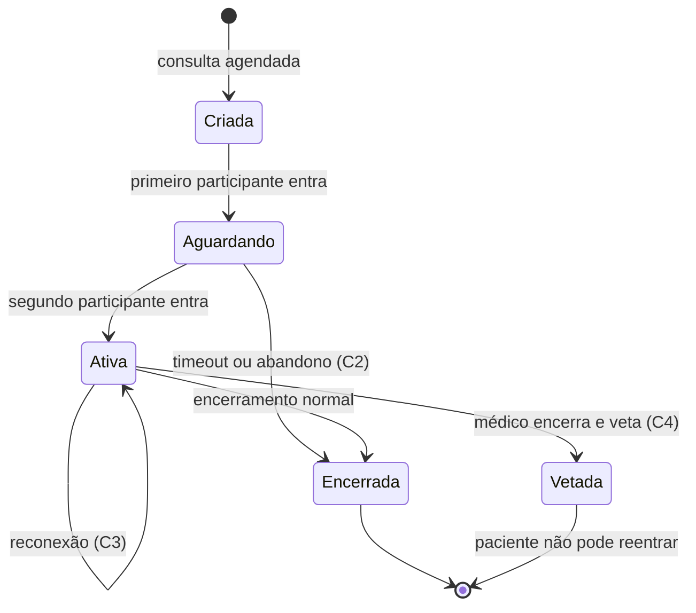

# Spike — Consultas online (Api.Saúde)

> **Objetivo desta spike:** definir critérios e evidências para escolher a **abordagem arquitetural** (não o provider/stack). Pesquisa de soluções e PoCs técnicos ficam para uma fase posterior.
>
> **Referência:** [PRD.md](./PRD.md)

---

## 0. Contexto levantado (Q&A)

Respostas coletadas que orientam a spike. Atualizar conforme novos dados.

| Pergunta | Resposta | Implicação para a spike |
|----------|----------|-------------------------|
| Quantos atendimentos por dia? | ~20/dia | Baseline de volume pequeno; custo direto de mídia não domina a decisão no MVP |
| Duração média? | ~60 min | Confirma C1; ~36.000 min de mídia/mês se 100% realizados |
| Participantes por chamada? | Sempre 2 (profissional + paciente) | Escopo **1:1 fixo** no MVP; sem salas multi-participante |
| Atendimentos em paralelo? | Sim, N em paralelo | Isolamento por sessão; concorrência modesta em escala absoluta |
| Budget aceitável? | Proposta primeiro → validação com stakeholders | Entregável financeiro é **proposta paramétrica**, não teto pré-definido |
| Plataformas? | Paciente: **mobile-first**; profissional e backoffice: **desktop + responsivo** | Clientes heterogêneos; C3 (reconexão) crítico no mobile |
| Realtime do ecossistema cobre vídeo? | **Não — apenas chat** (GetStream) | H3 não acelera escolha de stack de vídeo; reutilização limitada a práticas transversais |

**Ordem de grandeza (baseline):**

```
Consultas/mês           ≈ 20 × 30 = 600
Minutos de mídia/mês    ≈ 600 × 60 = 36.000  (100% realizadas, 2 participantes)
Min-participante/mês    ≈ 72.000             (2 × 60 min × 600 consultas)
```

---

## 1. Perguntas que a spike deve responder

| # | Pergunta | Resposta | Evidência | Status |
|---|----------|----------|-----------|--------|
| 1 | A capability de vídeo deve viver **acoplada à Api.Saúde** (H1) ou como **serviço/capability compartilhada** (H2)? | _Pendente — inclinação provisória: **H2 leve** ou **H1 com fronteira dura** (ver §4)_ | PRD (reuso) + volume baixo (velocidade) | 🟡 Parcial |
| 2 | Quem é a **fonte da verdade** do estado da sessão (criada, lobby, ativa, encerrada, vetada)? | _Pendente — inclinação: **backend/capability**, não cliente nem provider isolado_ | 3 superfícies de cliente + desencontros | 🔴 Aberto |
| 3 | Reconexão (C3) é **mesma sessão técnica** ou **nova sessão com continuidade de negócio**? | _Pendente — prioridade alta por mobile-first do paciente_ | Plataformas (§0) | 🔴 Aberto |
| 4 | O que são os **“desencontros”** hoje (sintoma, causa provável, impacto)? | _Pendente_ | Incidentes / suporte | 🔴 Aberto |
| 5 | Quanto de **prática operacional do ecossistema** (H3) se aplica a vídeo 1:1? | **Parcial:** chat (GetStream) reutiliza auth, observabilidade e padrões de integração; **não** cobre mídia, sinalização WebRTC, reconexão de vídeo nem ciclo de sessão 1:1 | Confirmação produto | 🟡 Parcial |
| 6 | Qual **modelo de custo** escala de forma sustentável com o volume esperado? | Baseline parametrizado (§3.5); **aceitabilidade** depende de proposta + validação stakeholders | §0, §3.5 | 🟡 Parcial |
| 7 | Qual estratégia de **migração** desde Go Rooms (Twilio) é aceitável no MVP? | _Pendente_ | | 🔴 Aberto |

---

## 2. Hipóteses em avaliação

| ID | Hipótese | Resumo | Status |
|----|----------|--------|--------|
| H1 | Solução acoplada à Api.Saúde | Menor complexidade inicial; maior acoplamento e menor reuso | ➖ Neutro — volume baixo favorece velocidade, mas PRD pede reuso |
| H2 | Capability desacoplada / shared | Maior reuso e evolução independente; maior custo inicial | ✅ A favor — inclinação provisória (contrato estável para 3 clientes + reuso) |
| H3 | Reaproveitar práticas do ecossistema | Menor curva operacional se o escopo couber; risco de assumir paridade inexistente | ➖ Neutro — **chat ≠ vídeo**; não reduz escolha de stack de mídia |

**Nota:** H3 **não** implica reutilizar GetStream para vídeo — o produto realtime atual cobre **apenas chat**. O reaproveitável é transversal: auth, observabilidade, padrões de integração com providers externos. A capability de vídeo é **net-new** em stack e operação.

---

## 3. Dimensões de avaliação

### 3.1 Requisitos por cenário (derivados do PRD)

| Cenário | Requisito funcional | Regra de negócio | Responsabilidade negócio | Responsabilidade vídeo | Critério de aceite (spike) |
|---------|---------------------|------------------|--------------------------|------------------------|----------------------------|
| **C1** | Médico e paciente em consulta ~60 min | Duração média **~60 min** confirmada; ambos podem encerrar? | | | Duração validada (§0) |
| **C2** | Um lado não entra | Timeout de espera; quem encerra; sessão órfã | | | |
| **C3** | Reconexão após queda | Mesma sessão vs nova; grace period; UX | | | |
| **C4** | Médico encerra e veta paciente | Fim definitivo; paciente não reentra | | | |

### 3.2 Modelo de sessão e consistência

| Aspecto | Definição proposta | Risco se mal definido | Decisão |
|---------|-------------------|------------------------|---------|
| Estados da sessão | _Ex.: criada → aguardando → ativa → encerrada → vetada_ | Desencontros entre UI e backend | |
| Quem dispara transições | Cliente / Api.Saúde / capability / provider | Sessão presa, timeout errado | |
| Idempotência (duplo clique, refresh, 2 abas) | | Duplicidade de participante | |
| Concorrência (entrada simultânea, reconexão parcial) | N consultas em paralelo; 2 participantes fixos por sessão | Um lado “online”, outro não | Isolamento por consulta |
| Correlação consulta ↔ sessão ↔ participante | IDs, logs, traces | Suporte e debug impossíveis | |

### 3.3 Colocação arquitetural (H1 vs H2)

| Critério | Peso (1–3) | H1 | H2 | Notas |
|----------|------------|----|----|-------|
| Time-to-MVP | 2 | ✅ | ➖ | ~20/dia; escopo 1:1 simples |
| Reuso entre produtos Clin&Co | 3 | ❌ | ✅ | Objetivo explícito do PRD |
| Evolução / deploy independente | 2 | ❌ | ✅ | Vídeo é net-new vs chat |
| Clareza de ownership operacional | 2 | ➖ | ✅ | Capability dedicada facilita runbooks |
| Custo de contrato público antes do 2º consumidor | 1 | ✅ | ➖ | Volume baixo tolera contrato mínimo |

_Escala: ❌ = desfavorável · ➖ = neutro · ✅ = favorável._

### 3.4 Fronteira negócio × capability de vídeo

| Responsabilidade | Dono negócio (consulta/agenda) | Dono capability vídeo | Observação |
|------------------|-------------------------------|------------------------|------------|
| Agendamento / slot da consulta | | | |
| Autorização de entrada (roles) | | | |
| Limite de duração (~60 min) | | | |
| Encerramento e veto pós-fim (C4) | | | |
| Política de reconexão (C3) | | | |
| Emissão de credenciais/tokens de mídia | | | |
| Métricas para custo e SLA | | | |

### 3.5 Viabilidade financeira (modelo paramétrico)

Preencher variáveis; valores numéricos podem ficar como placeholder até fase de provider.

| Variável | Símbolo | Valor estimado | Fonte / suposição |
|----------|---------|----------------|-------------------|
| Consultas por dia | `N_dia` | **20** | Q&A produto |
| Duração média real (min) | `T_med` | **60** | Q&A produto |
| Taxa de no-show (C2) | `P_no_show` | _pendente_ | Impacta custo de lobby |
| Taxa de reconexão por consulta | `P_recon` | _pendente_ | Crítico no mobile |
| Participantes médios por sessão ativa | `P_sess` | **2** (fixo) | Q&A produto |
| Minutos ociosos em lobby (C2) | `T_lobby` | _pendente_ | Depende de timeout de espera |

**Drivers de custo a mapear (qualquer abordagem):**

- [ ] Cobrança por minuto de mídia
- [ ] Cobrança por sessão/sala criada
- [ ] Cobrança por participante conectado
- [ ] Custo de sessão abandonada (C2)
- [ ] Impacto de reconexão (C3) — nova sessão vs continuidade
- [ ] Sensibilidade a pico horário

**Fórmula rascunho (ajustar conforme modelo escolhido depois):**

```
Custo_mensal ≈ N_dia × 30 × (
  (1 - P_no_show) × T_med × custo_minuto
  + P_no_show × T_lobby × custo_sessão_ociosa
  + (1 - P_no_show) × P_recon × custo_reconexão
)
```

| Cenário de volume | N_dia | Minutos mídia/mês | Custo mensal estimado | Observação |
|-------------------|-------|-------------------|----------------------|------------|
| Baseline | 20 | ~36.000 | _plugar `custo_minuto`_ | 600 consultas/mês |
| 2× baseline | 40 | ~72.000 | | |
| 10× baseline | 200 | ~360.000 | | Crescimento agressivo |

**Processo de budget:** elaborar proposta com a fórmula acima + cenários → stakeholders validam aceitabilidade (sem teto numérico pré-definido).

### 3.6 Capacidade operacional

| Item | Existe hoje? | Gap | Necessário para MVP? |
|------|--------------|-----|----------------------|
| Runbook: sessão presa | | | |
| Runbook: paciente não entra (C2) | | | |
| Runbook: falha de reconexão (C3) | | | |
| Runbook: encerramento / veto (C4) | | | |
| Suporte: localizar consulta por ID | | | |
| SLI: % sessões estáveis até o fim | | | |
| SLI: reconexão bem-sucedida em X min | | | |
| SLI: tempo máximo em lobby | | | |
| Alertas / dashboards | | | |

### 3.7 Flexibilidade e lock-in

| Critério | Importância (1–3) | Notas |
|----------|-------------------|-------|
| Troca de provider de mídia sem reescrever regras de consulta | | |
| Clientes heterogêneos (web, app, futuros produtos) | **3** | Paciente mobile-first; profissional/backoffice desktop+responsivo — SDK/contrato deve funcionar em ambos |
| Extensões futuras (gravação, transcrição, 3º participante) | | |
| Onde aceitamos lock-in (mídia vs sinalização vs estado) | | |

### 3.8 Migração desde Go Rooms (Twilio)

| Item | Decisão / nota |
|------|----------------|
| Paridade mínima com C1–C4 antes de desligar legado | |
| Estratégia (feature flag, cohort, rollback) | |
| Comportamento aceitável **diferente** no MVP | |
| Período de convivência dupla | |

---

## 4. Matriz de decisão (hipóteses × dimensões)

Legenda: **F** = favorece · **N** = neutro · **P** = prejudica · **?** = desconhecido

| Dimensão | H1 Acoplado | H2 Desacoplado | H3 Reuso ecossistema |
|----------|-------------|----------------|----------------------|
| Time-to-MVP | F | N | N (chat não cobre vídeo) |
| Reuso multi-produto | P | F | N |
| Consistência de sessão (C2–C4) | P | F | ? |
| Custo previsível em escala | N | N | N |
| Operação / suporte | N | F | N (vídeo é net-new) |
| Flexibilidade / lock-in | P | F | N |
| Migração desde Twilio | N | N | N |

**Recomendação preliminar:**

> **Direção provisória: H2 (capability desacoplada) ou H1 com fronteira dura já preparada para extração** — contrato mínimo de sessão (criar, entrar, estado, reconectar, encerrar/vetar) consumido pela Api.Saúde e pelos 3 clientes.
>
> **Por quê:** volume baixo (~20/dia) favorece velocidade, mas o PRD prioriza reuso, desacoplamento e consistência de sessão (C2–C4). Três superfícies de cliente (mobile paciente + desktop profissional/backoffice) pedem orquestração central de estado — espalhar no cliente ou acoplar sem contrato tende a reproduzir desencontros.
>
> **H3 esclarecido:** GetStream cobre **chat**, não vídeo. Reutilizar auth/observabilidade/padrões de integração; **não** assumir paridade de stack ou operação de vídeo.
>
> **Ainda exige decisão/PoC:** fonte da verdade de estado, política de reconexão (C3), definição de desencontros, taxa de no-show, migração Twilio.

---

## 5. Unknowns (bloqueadores e suposições)

| # | Unknown | Impacto se errado | Como validar | Responsável | Prazo | Status |
|---|---------|-------------------|--------------|-------------|-------|--------|
| 1 | Volume: consultas/dia, duração média, no-show | Modelo de custo e capacidade | Dados produto/ops | Produto | | 🟡 Parcial — falta no-show |
| 2 | Clientes: web, mobile, ambos | Contrato e SDK | Arquitetura frontend | Produto | | ✅ Resolvido (§0) |
| 3 | Quem inicia a sala (médico primeiro?) | Fluxo C1/C2 | Produto | | | 🔴 Aberto |
| 4 | Definição operacional de “desencontro” | Prioridade de reconexão/estado | Incidentes / suporte | Suporte | | 🔴 Aberto |
| 5 | Compliance (LGPD, retenção, gravação) | Escopo MVP vs roadmap | Jurídico / segurança | | | 🔴 Aberto |
| 6 | SLA de produto (% reconexão, tempo lobby) | SLIs e arquitetura | Produto + SRE | | | 🔴 Aberto |
| 7 | Gravação / auditoria no roadmap | Impacto arquitetura cedo | Produto | | | 🔴 Aberto |
| 8 | GetStream / realtime cobre vídeo? | Assumir H3 indevidamente | Produto / engenharia | | | ✅ Resolvido — **apenas chat** |

---

## 6. Checklist por cenário (validação da abordagem)

Use antes de qualquer PoC: a abordagem escolhida precisa **endereçar explicitamente** cada item.

### C1 — Médico e paciente conectados (~60 min)

- [ ] Fluxo: médico entra → aguarda → paciente entra → consulta ativa
- [ ] Limite de duração definido (regra + enforcement)
- [ ] Ambos conseguem encerrar? (definir papel assimétrico se não)
- [ ] Encerramento limpa estado e métricas
- [ ] Correlação de logs consulta/sessão/participantes

### C2 — Um lado não entra

- [ ] Estado “aguardando” com timeout configurável
- [ ] Quem pode encerrar sem atendimento
- [ ] Comportamento de sessão órfã (cleanup, billing)
- [ ] UX clara para o lado que entrou
- [ ] Métrica: taxa de no-show / abandono em lobby

### C3 — Reconexão

- [ ] Política documentada: mesma sessão vs nova
- [ ] Grace period e expiração
- [ ] Outro participante permanece na sala ou também reconecta?
- [ ] Sincronização de estado após reconexão (evitar desencontro)
- [ ] SLI: reconexão bem-sucedida em X minutos

### C4 — Médico encerra e veta paciente

- [ ] Transição para estado terminal (não reentrada)
- [ ] Apenas médico (ou regra explícita) dispara veto
- [ ] Paciente bloqueado após fim — técnico e de negócio
- [ ] Mensagem/UX para paciente tardio
- [ ] Auditoria do evento de encerramento

---

## 7. Diagrama de estados (rascunho)

Preencher e validar com produto/engenharia. Mermaid é editável conforme decisões.



**Decisões pendentes no diagrama:**

- [ ] Quem pode transicionar `Aguardando → Encerrada`?
- [ ] `Ativa → Ativa` na reconexão: mesma sala ou nova?
- [ ] `Vetada` impede qualquer reentrada ou só paciente?

---

## 8. Entregáveis desta fase

| Entregável | Status | Link / nota |
|------------|--------|-------------|
| Contexto Q&A documentado (seção 0) | ✅ | |
| Mapa cenário → requisito → dono (seção 3.1 + 3.4) | ⬜ | C1 parcialmente preenchido |
| Diagrama de estados validado (seção 7) | ⬜ | |
| Matriz H1/H2/H3 preenchida (seção 4) | 🟡 | Inclinação provisória registrada |
| Modelo de custo com variáveis (seção 3.5) | 🟡 | Baseline numérico; falta no-show e custo_minuto |
| Lista de unknowns resolvida ou escalada (seção 5) | 🟡 | #2 e #8 resolvidos |
| ADR de colocação arquitetural | ⬜ | Ver [ADR-001](./docs/adr/ADR-001-colocacao-videoconsulta.md) |
| Lista do que o PoC futuro deve provar | ⬜ | Ver seção 9 |

---

## 9. Escopo do PoC futuro (fora desta fase)

Somente **após** fechar critérios acima — não antecipar provider.

| Prova | Relacionado a | Prioridade |
|-------|---------------|------------|
| Reconexão C3 em rede instável (mobile paciente) | Estado + UX | **Alta** |
| Veto pós-encerramento C4 | Regra + enforce | Alta |
| Sessão órfã / timeout C2 | Cleanup + custo | Média |
| Carga simultânea (pico) | Escala + custo | Média |
| Paridade mínima vs Go Rooms | Migração | Média |

---

## 10. Registro de decisão (ADR)

| ADR | Título | Status |
|-----|--------|--------|
| [ADR-001](./docs/adr/ADR-001-colocacao-videoconsulta.md) | Colocação da capability de videoconsulta | Proposto |

---

## Histórico

| Data | Autor | Alteração |
|------|-------|-----------|
| 2026-05-20 | | Criação do documento de spike |
| 2026-05-20 | | Q&A de volume, plataformas e budget; esclarecimento chat≠vídeo; inclinação H2 provisória |
